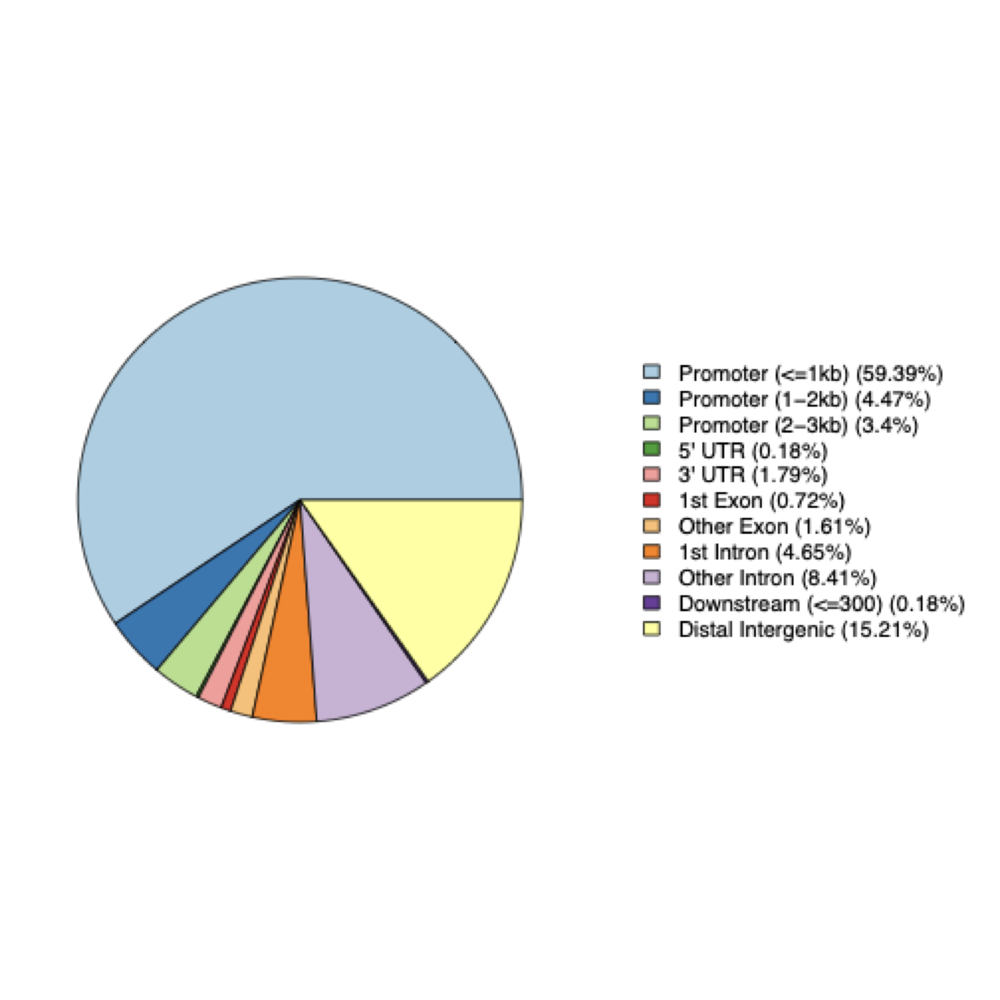

# Use Case: ATAC-Seq Analysis

## Overview

This use case demonstrates how to use Coala to perform query-driven ATAC-Seq analysis, including peak calling using ([MACS3](#macs3)), peak annotation using ([ChIPseeker](#chipseeker)), and peak visualization using ([pyGenomeTracks](#pygenometracks)). We'll use the GSE180599 dataset as an example, which contains ATAC-Seq data from BT549 triple-negative breast cancer cells in the presence and absence of MUC1-C protein.


## Setup

### MCP Server Configuration

Start an MCP server with ATAC-Seq analysis tools as shown in `examples/atac-seq/atac_question.py`:

```python
from coala.mcp_api import mcp_api
import os
base_dir = os.path.dirname(__file__)

mcp = mcp_api(host='0.0.0.0', port=8000)
mcp.add_tool(os.path.join(base_dir, 'macs3_callpeak.cwl'))
mcp.add_tool(os.path.join(base_dir, 'peakAnno.cwl'))
mcp.add_tool(os.path.join(base_dir, 'pygenometracks_peak.cwl'))
mcp.serve()
```

This server exposes three tools:
- **`macs3_callpeak`**: Calls peaks from ATAC-Seq data using ([MACS3](#macs3))
- **`ChIPSeeker`**: Annotates peaks with genomic features using [ChIPseeker](#chipseeker))
- **`pygenometracks_peak`**: Visualizes peaks and coverage tracks alongside gene annotations using ([pyGenomeTracks](#pygenometracks))

### MCP Client Configuration

Configure your MCP client (e.g., Claude Desktop, Cursor) to connect to the MCP server:

```json
{
    "mcpServers": {
        "atac-seq": {
            "command": "python",
            "args": ["/path/to/examples/ATAC-Seq/ATAC-Seq_mcp.py"]
        }
    }
}
```

Note: Replace `/path/to/examples/ATAC-Seq/ATAC-Seq_mcp.py` with the actual path to the `ATAC-Seq_mcp.py` file in your workspace.

## Use Case Workflow

For demo purposes, we utilize human ATAC-Seq data from the BT-549 human triple negative breast cancer cell line ([Bhattacharya and et al.](https://doi.org/10.1158/1541-7786.MCR-21-0672)), using only the reads mapped to chromosome 22. The alignment file is in BAM format for the paired-end ATAC-seq library.

### Step 1: Call Peaks with macs3 and Summarize

**User Query:**

> Here is a BAM file for the ATAC-seq data: BT549_Doxminus_chr22.bam. Call peaks for the BAM file using paired end mode, and summarize the number of peaks. Use genome size of 5e7 which is approximately the size for human chromosome 22. Keep all duplicate tags. Save extended fragment pileup and local lambda tracks at every bp into a bedGraph file. Do not call subpeak summits.

**Tool Invocation:**
```json
{
  "tool": "macs3_callpeak",
  "parameters": {
    "treatment": "./examples/ATAC-Seq/BT549_Doxminus_chr22.bam",
    "format": "BAMPE",
    "gsize": "5e7",
    "keepdup": "all",
    "bdg": true,
    "summits": false,
    "name": "BT549_Doxminus_chr22"
  }
}
```

**Tool Response:**
```json
{
  "narrowPeak": {
    "location": "./examples/ATAC-Seq/BT549_Doxminus_chr22_peaks.narrowPeak",
    "basename": "BT549_Doxminus_chr22_peaks.narrowPeak",
    "size": 70916
  },
  "xlsPeak": {
    "location": "./examples/ATAC-Seq/BT549_Doxminus_chr22_peaks.xls",
    "basename": "BT549_Doxminus_chr22_peaks.xls",
    "size": 77367
  },
  "teatBdg": {
    "location": "./examples/ATAC-Seq/BT549_Doxminus_chr22_treat_pileup.bdg",
    "basename": "BT549_Doxminus_chr22_treat_pileup.bdg",
    "size": 17502010
  },
  "controlBdg": {
    "location": "./examples/ATAC-Seq/BT549_Doxminus_chr22_control_lambda.bdg",
    "basename": "BT549_Doxminus_chr22_control_lambda.bdg",
    "size": 25986774
  },
  "tool_name": "macs3_callpeak",
  "tool_version": "quay.io/biocontainers/macs3:3.0.3--py39h0699b22_0"
}
```

**Chat Response:**

> Peak calling completed. Summary:
> 
> ## Peak Calling Results
> 
> **Parameters used:**
> - **Input file:** BT549_Doxminus_chr22.bam
> - **Mode:** Paired-end (BAMPE format)
> - **Genome size:** 5e7 (50,000,000 bp, approximately human chromosome 22)
> - **Duplicate handling:** All duplicate tags kept (`--keep-dup all`)
> - **BedGraph output:** Enabled (extended fragment pileup and local lambda tracks saved)
> - **Subpeak summits:** Disabled
> 
> **Results:**
> - **Total number of peaks:** **815 peaks**
> 
> **Output files generated:**
> 1. `BT549_Doxminus_chr22_peaks.narrowPeak` - BED6+4 format file with peak locations (815 peaks)
> 2. `BT549_Doxminus_chr22_peaks.xls` - Tabular file with detailed peak information
> 3. `BT549_Doxminus_chr22_treat_pileup.bdg` - BedGraph file for treatment sample (extended fragment pileup)
> 4. `BT549_Doxminus_chr22_control_lambda.bdg` - BedGraph file for control/lambda tracks
> 
> All peaks are located on chromosome 22, with peak IDs ranging from `BT549_Doxminus_chr22_peak_1` to `BT549_Doxminus_chr22_peak_815`.

### Step 2: Rerun with More Stringent q-value Cutoff

**User Query:**

> Use a more stringent q value cutoff 0.001 and rerun peak calling, summarize the number of peaks.

**Tool Invocation:**
```json
{
  "tool": "macs3_callpeak",
  "parameters": {
    "treatment": "./examples/ATAC-Seq/BT549_Doxminus_chr22.bam",
    "format": "BAMPE",
    "gsize": "5e7",
    "keepdup": "all",
    "bdg": true,
    "summits": false,
    "name": "BT549_Doxminus_chr22_q001",
    "qvalue": 0.001
  }
}
```

**Tool Response:**
```json
{
  "narrowPeak": {
    "location": "./examples/ATAC-Seq/BT549_Doxminus_chr22_q001_peaks.narrowPeak",
    "basename": "BT549_Doxminus_chr22_q001_peaks.narrowPeak",
    "size": 51543
  },
  "xlsPeak": {
    "location": "./examples/ATAC-Seq/BT549_Doxminus_chr22_q001_peaks.xls",
    "basename": "BT549_Doxminus_chr22_q001_peaks.xls",
    "size": 56210
  },
  "teatBdg": {
    "location": "./examples/ATAC-Seq/BT549_Doxminus_chr22_q001_treat_pileup.bdg",
    "basename": "BT549_Doxminus_chr22_q001_treat_pileup.bdg",
    "size": 17502010
  },
  "controlBdg": {
    "location": "./examples/ATAC-Seq/BT549_Doxminus_chr22_q001_control_lambda.bdg",
    "basename": "BT549_Doxminus_chr22_q001_control_lambda.bdg",
    "size": 25986774
  },
  "tool_name": "macs3_callpeak",
  "tool_version": "quay.io/biocontainers/macs3:3.0.3--py39h0699b22_0"
}
```

**Chat Response:**

> Peak calling with the stricter q-value cutoff completed. Summary:
> 
> ## Peak Calling Results with q-value = 0.001
> 
> **Parameters used:**
> - **Input file:** BT549_Doxminus_chr22.bam
> - **Mode:** Paired-end (BAMPE format)
> - **Genome size:** 5e7 (50,000,000 bp)
> - **Duplicate handling:** All duplicate tags kept (`--keep-dup all`)
> - **BedGraph output:** Enabled
> - **Subpeak summits:** Disabled
> - **Q-value cutoff:** **0.001** (stricter than default 0.05)
> 
> **Results:**
> - **Total number of peaks:** **559 peaks**
> 
> **Comparison:**
> - **Default q-value (0.05):** 815 peaks
> - **Stricter q-value (0.001):** 559 peaks
> - **Reduction:** 256 fewer peaks (31.4% reduction)
> 
> The stricter q-value cutoff (0.001) filters peaks with higher false discovery rates, resulting in fewer, more confident peaks. The 559 peaks range from `BT549_Doxminus_chr22_q001_peak_1` to `BT549_Doxminus_chr22_q001_peak_559`.
> 
> **Output files generated:**
> 1. `BT549_Doxminus_chr22_q001_peaks.narrowPeak` - BED6+4 format file with 559 peaks
> 2. `BT549_Doxminus_chr22_q001_peaks.xls` - Tabular file with detailed peak information
> 3. `BT549_Doxminus_chr22_q001_treat_pileup.bdg` - BedGraph file for treatment sample
> 4. `BT549_Doxminus_chr22_q001_control_lambda.bdg` - BedGraph file for control/lambda tracks

### Step 3: Annotate Peaks with ChIPSeeker

**User Query:**

> Annotate the peak set from q-value cutoff 0.001.

**Tool Invocation:**
```json
{
  "tool": "ChIPSeeker",
  "parameters": {
    "peak": "./examples/ATAC-Seq/BT549_Doxminus_chr22_q001_peaks.narrowPeak"
  }
}
```

**Tool Response:**
```json
{
  "ann": {
    "location": "./examples/ATAC-Seq/BT549_Doxminus_chr22_q001_peaks.narrowPeak_peakAnno.csv",
    "basename": "BT549_Doxminus_chr22_q001_peaks.narrowPeak_peakAnno.csv",
    "size": 110270
  },
  "pie": {
    "location": "./examples/ATAC-Seq/BT549_Doxminus_chr22_q001_peaks.narrowPeak_AnnoPie.pdf",
    "basename": "BT549_Doxminus_chr22_q001_peaks.narrowPeak_AnnoPie.pdf",
    "size": 5885
  },
  "tool_name": "ChIPSeeker",
  "tool_version": "hubentu/bioconductor-chipseeker:1.42.0"
}
```

**Chat Response:**

> Peak annotation completed. Summary:
> 
> ## Peak Annotation Results
> 
> **Input:** BT549_Doxminus_chr22_q001_peaks.narrowPeak (559 peaks with q-value ≤ 0.001)
> 
> **Annotation Summary by Major Categories:**
> 
> | Category | Count | Percentage |
> |----------|-------|------------|
> | **Promoter regions** | 376 | 67.3% |
> | - Promoter (≤1kb) | 332 | 59.4% |
> | - Promoter (1-2kb) | 25 | 4.5% |
> | - Promoter (2-3kb) | 19 | 3.4% |
> | **Distal Intergenic** | 85 | 15.2% |
> | **Intron** | 73 | 13.1% |
> | **Exon** | 13 | 2.3% |
> | **UTR** | 11 | 2.0% |
> | - 3' UTR | 10 | 1.8% |
> | - 5' UTR | 1 | 0.2% |
> | **Downstream (≤300bp)** | 1 | 0.2% |
> 
> **Total peaks annotated:** 559
> 
> **Key findings:**
> - 67.3% of peaks are in promoter regions (within 3kb of TSS), consistent with ATAC-seq detecting open chromatin near gene promoters.
> - 15.2% are in distal intergenic regions, likely enhancers or other regulatory elements.
> - 13.1% are in introns, which may contain regulatory elements.
> - Only 2.3% are in exons, as expected for ATAC-seq.
> 
> **Output files generated:**
> 1. `BT549_Doxminus_chr22_q001_peaks.narrowPeak_peakAnno.csv` - Detailed annotation CSV file with gene information, transcript IDs, and distance to TSS
> 2. `BT549_Doxminus_chr22_q001_peaks.narrowPeak_AnnoPie.pdf` - Pie chart visualization of annotation categories
> 
> The annotation file includes genomic coordinates, associated genes, transcript IDs, and distance to transcription start sites (TSS) for each peak.

**Peak Annotation Visualization:**



*Figure: ChIPseeker pie chart showing the distribution of ATAC-Seq peaks across various genomic features. The chart displays the percentage of peaks falling into different genomic regions such as promoters, introns, exons, 5' UTR, 3' UTR, and intergenic regions, providing insight into where accessible chromatin regions are located relative to gene structures.*


### Step 4: Visualize Peaks with pyGenomeTracks

**User Query:**

> let's visualize the peak in the chr22:23,161,760-23,359,701 region in a genome browser view.

**Tool Invocation:**
```json
{
  "tool": "pygenometracks_peak",
  "parameters": {
    "peak": "./examples/ATAC-Seq/BT549_Doxminus_chr22_q001_peaks.narrowPeak",
    "bedgraph": "./examples/ATAC-Seq/BT549_Doxminus_chr22_q001_treat_pileup.bdg",
    "gene": "./examples/ATAC-Seq/chr22_gene.bed",
    "region": "chr22:23,161,760-23,359,701",
    "outname": "BT549_Doxminus_chr22_region_visualization.png"
  }
}
```

**Tool Response:**
```json
{
  "trackplot": {
    "location": "./examples/ATAC-Seq/BT549_Doxminus_chr22_region_visualization.png",
    "basename": "BT549_Doxminus_chr22_region_visualization.png",
    "size": 30587
  },
  "tool_name": "pygenometracks_peak",
  "tool_version": "quay.io/biocontainers/pygenometracks:3.9--pyhdfd78af_0"
}
```

**Chat Response:**

> Genome browser visualization created. Summary:
> 
> ## Genome Browser Visualization
> 
> **Region visualized:** chr22:23,161,760-23,359,701 (197,942 bp)
> 
> **Peaks in this region:** 4 peaks detected:
> 1. **Peak 95**: chr22:23,178,580-23,178,856 (276 bp)
> 2. **Peak 96**: chr22:23,180,202-23,180,785 (583 bp)
> 3. **Peak 97**: chr22:23,281,795-23,282,045 (250 bp)
> 4. **Peak 98**: chr22:23,315,515-23,316,031 (516 bp)
> 
> **Visualization tracks:**
> 1. **Coverage track** (bedGraph) — ATAC-seq signal coverage across the region
> 2. **Peaks track** (narrowPeak) — MACS3-called peaks shown as boxes
> 3. **Gene annotation track** (BED) — Gene annotations from chr22_gene.bed
> 
> **Output file:**
> - `BT549_Doxminus_chr22_region_visualization.png` — PNG image (1133 × 297 pixels)
> 
> The visualization shows:
> - ATAC-seq signal intensity (coverage)
> - Called peaks overlaid on the signal
> - Gene annotations for context
> 
> The image is saved and ready for viewing. The peaks are distributed across the region, with the strongest signal at Peak 98 (q-value: 11.874).

**Generated Peak Visualization:**


*Figure: pyGenomeTracks output showing the chr22:23,161,760-23,359,701 region. The plot displays ATAC-Seq read coverage (top track), called peaks (middle track), and the gene annotations (bottom track). The peaks correspond to accessible chromatin regions identified by MACS3 with q-value ≤ 0.001.*

## Key Benefits

1. **Natural Language Interface**: ATAC-Seq analysis from peak calling to visualization accessible through simple queries
2. **Automatic Tool Chaining**: Results from peak calling are automatically used for visualization and annotation
3. **Reproducible Analysis**: All tools run in containerized environments with specified versions
4. **Human-in-the-Loop Analysis**: Users can adjust parameters like q-value thresholds, fix issues during analysis, and visualization regions through natural language

## Technical Details

### Tool Execution

All tools execute in Docker containers as specified in their CWL definitions:
- **macs3**: Model-based Analysis of ChIP-Seq (v3.0.3)
- **ChIPseeker**: ChIP peak annotation (v1.42.0)
- **pyGenomeTracks**: Genome browser track visualization (v3.9)

### macs3 Parameters Explained

| Parameter | Value | Description |
|-----------|-------|-------------|
| `format` | BAMPE | Paired-end BAM format for ATAC-seq |
| `gsize` | 5e7 | The effective size of human chromosome 22 |
| `keepdup` | all | Retains all duplicate reads |
| `bdg` | true | Outputs bedGraph files for visualization |
| `summits` | false | Do not identify subpeak summits |
| `qvalue` | 0.001 | Minimum FDR threshold for peak calling (default: 0.05) |

### Data Flow

1. ATAC-Seq reads (BAM format) are processed by macs3 in paired-end mode
2. macs3 identifies enriched regions (peaks) representing open chromatin
3. bedGraph coverage tracks are generated for visualization
4. q-value tweaking is demonstrated during peak calling to control false discovery rate
5. ChIPseeker annotates peaks with genomic features (promoters, introns, exons, intergenic) and nearest genes
6. pyGenomeTracks combines peaks, coverage, and gene annotations into a single plot

### Output Files

| Step | File | Description |
|------|------|-------------|
| 1 | `BT549_Doxminus_chr22_peaks.narrowPeak` | Peak locations (BED6+4 format, 815 peaks) |
| 1 | `BT549_Doxminus_chr22_peaks.xls` | Detailed peak statistics |
| 1 | `BT549_Doxminus_chr22_treat_pileup.bdg` | Treatment coverage (bedGraph) |
| 1 | `BT549_Doxminus_chr22_control_lambda.bdg` | Local background estimate |
| 2 | `BT549_Doxminus_chr22_q001_peaks.narrowPeak` | Peaks filtered by q-value threshold during calling (559 peaks) |
| 2 | `BT549_Doxminus_chr22_q001_peaks.xls` | Detailed peak statistics for q-value filtered set |
| 2 | `BT549_Doxminus_chr22_q001_treat_pileup.bdg` | Treatment coverage for q-value filtered set |
| 2 | `BT549_Doxminus_chr22_q001_control_lambda.bdg` | Control lambda tracks for q-value filtered set |
| 3 | `BT549_Doxminus_chr22_q001_peaks.narrowPeak_peakAnno.csv` | Peak annotation with genomic features |
| 3 | `BT549_Doxminus_chr22_q001_peaks.narrowPeak_AnnoPie.pdf` | Pie chart of peak distribution by feature |
| 4 | `BT549_Doxminus_chr22_region_visualization.png` | Genome browser visualization |

## Extending the Workflow

This use case can be extended to:
- Compare peaks between conditions using differential peak analysis
- Perform motif analysis on peak sequences
- Integrate with RNA-Seq data for multi-omic analysis
- Generate signal heatmaps around transcription start sites
- Identify transcription factor footprints within peaks
- Export peaks to UCSC Genome Browser or IGV
- Filter peaks by additional criteria (fold enrichment, p-value, etc.)

All of these extensions can be implemented by adding additional CWL tools to the MCP server and querying them through natural language.

## Reference

<a id="macs3"></a>
MACS3
https://github.com/macs3-project/MACS

<a id="chipseeker"></a>
ChIPseeker
https://www.bioconductor.org/packages/release/bioc/html/ChIPseeker.html

<a id="pygenometracks"></a>
pyGenomeTracks
https://github.com/deeptools/pyGenomeTracks

