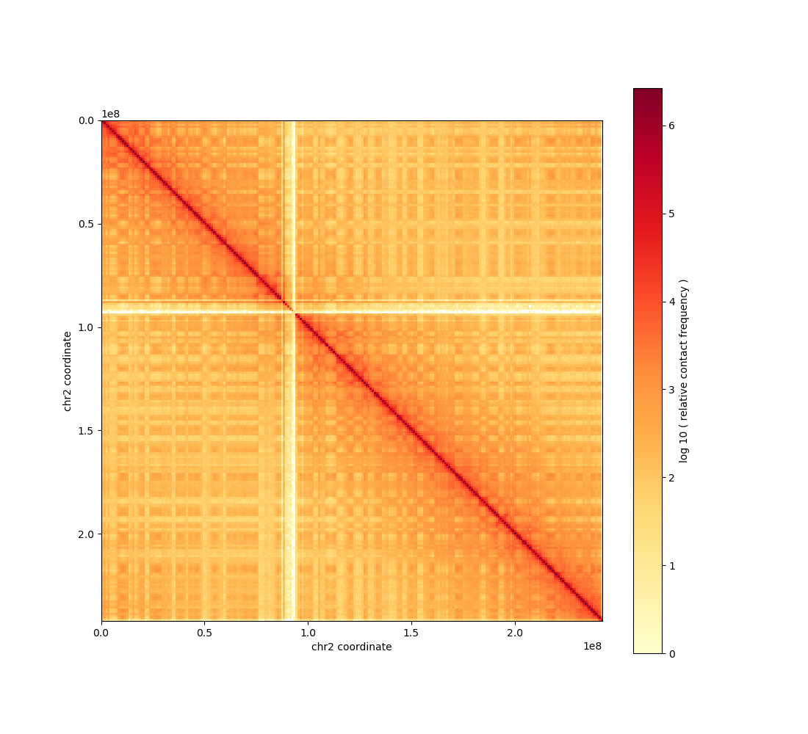

# Use Case: Hi-C Analysis

## Overview


This use case demonstrates how to use Coala to perform query-driven Hi-C analysis, including visualizing chromatin contact maps ([cooler](https://open2c.github.io/cooler/)), calculating expected cis-contacts and compartment profiles, visualizing compartmentalization with saddle plots, and identifying boundaries between topologically associating domains ([cooltools](https://cooltools.readthedocs.io/en/latest/)). We use a multi-resolution mcool file (`test.mcool`) containing Micro-C data for chromosomes 2 and 17 of HFF cell line , together with a view BED (`view_hg38.tsv`) and GC content track (`gc.100000.tsv`).


## Setup

### MCP Server Configuration

Start an MCP server with Hi-C analysis tools as shown in `examples/Hi-C/Hi-C_mp.py`:

```python
from coala.mcp_api import mcp_api
import os
base_dir = os.path.dirname(__file__)

mcp = mcp_api(host='0.0.0.0', port=8000)
mcp.add_tool(os.path.join(base_dir, 'cooler_dump.cwl'))
mcp.add_tool(os.path.join(base_dir, 'cooler_show.cwl'))
mcp.add_tool(os.path.join(base_dir, 'cooltools_eigs_cis.cwl'))
mcp.add_tool(os.path.join(base_dir, 'cooltools_expected_cis.cwl'))
mcp.add_tool(os.path.join(base_dir, 'cooltools_genome_gc.cwl'))
mcp.add_tool(os.path.join(base_dir, 'cooltools_insulation.cwl'))
mcp.add_tool(os.path.join(base_dir, 'cooltools_saddle.cwl'))
mcp.serve()
```

This server exposes tools from **cooler** and **cooltools**:
- **`cooler_show`**: Display contact matrices for specified chromosomes and resolutions
- **`cooltools_expected_cis`**: Calculate expected Hi-C signal for cis regions (decay curve)
- **`cooltools_eigs_cis`**: Compute compartment profiles via eigenvalue decomposition with optional GC phasing
- **`cooltools_saddle`**: Generate saddle plots from eigenvectors and expected contacts
- **`cooltools_insulation`**: Calculate diamond insulation scores and call topologically associating domains (TAD) boundaries

### MCP Client Configuration

Configure your MCP client (e.g., Claude Desktop, Cursor) to connect to the MCP server:

```json
{
    "mcpServers": {
        "user-hi_c": {
            "command": "python",
            "args": ["/path/to/examples/Hi-C/Hi-C_mp.py"]
        }
    }
}
```

Note: Replace `/path/to/examples/Hi-C/Hi-C_mp.py` with the actual path to the `Hi-C_mp.py` file in your workspace.

### Data Sets

The data file (`test.mcool`) is from the Micro-C study on HFF cell line (see [cooltools external test files](https://github.com/open2c/cooltools/blob/master/datasets/external_test_files.tsv)). Place `view_hg38.tsv`, `gc.100000.tsv`, and `bins.100000.tsv` from the [examples/Hi-C](https://github.com/coala-info/coala-info.github.io/tree/main/examples/Hi-C) directory in the same working directory as `test.mcool` for the full workflow.

## Use Case Workflow

The workflow uses `test.mcool` at multiple resolutions (10 kb, 100 kb, 1 Mb) and the view file `view_hg38.tsv` defining chr2_p, chr2_q, chr17_p, and chr17_q.

### Step 1: Show Contact Map

**User Query:**

> Here is a mcool file for the Hi-C data: test.mcool. Investigate the chr sizes then show the contact map on chromosome 2 with 1Mb resolution. Save the output to working directory.

**Tool Invocation:**
```json
{
  "tool": "cooler_show",
  "parameters": {
    "data": [
      {
        "fcool": "/path/to/examples/Hi-C/test.mcool",
        "uri": "resolutions/1000000",
        "range": "chr2:0-242193529",
        "output": "/path/to/working_dir/contact_map_chr2_1mb.png"
      }
    ]
  }
}
```

**Tool Response:**
```json
{
  "out": {
    "location": "file:///var/folders/.../contact_map_chr2_1mb.png",
    "basename": "contact_map_chr2_1mb.png",
    "class": "File",
    "size": 164916
  },
  "tool_name": "cooler_show",
  "tool_version": "quay.io/biocontainers/cooltools:0.7.1--py311h93dcfea_3"
}
```

**Chat Response:**

> The chromosome 2 contact map at 1 Mb resolution has been generated and saved to your working directory as **`contact_map_chr2_1mb.png`**.
>
> The image is a 242×242 contact matrix for chr2 (0–242,193,529 bp), showing Hi-C contact frequency. The MCP tool wrote the figure to a temp path; it was then copied to the working directory.



**User Query:**

> How about chr17?

**Tool Invocation:**
```json
{
  "tool": "cooler_show",
  "parameters": {
    "data": [
      {
        "fcool": "/path/to/examples/Hi-C/test.mcool",
        "uri": "resolutions/1000000",
        "range": "chr17:0-83257441",
        "output": "/path/to/working_dir/contact_map_chr17_1mb.png"
      }
    ]
  }
}
```

**Tool Response:**
```json
{
  "out": {
    "location": "file:///var/folders/.../contact_map_chr17_1mb.png",
    "basename": "contact_map_chr17_1mb.png",
    "class": "File",
    "size": 52278
  },
  "tool_name": "cooler_show",
  "tool_version": "quay.io/biocontainers/cooltools:0.7.1--py311h93dcfea_3"
}
```

**Chat Response:**

> The chromosome 17 contact map at 1 Mb resolution has been generated and saved as **`contact_map_chr17_1mb.png`**. Chr17 is shorter than chr2, so the matrix is smaller (~83×83 bins).


*The contact map is a 2D heatmap of Hi-C contact frequency, reflecting 3D genome folding. Warmer colors indicate higher contact frequency; structures such as compartments and TADs appear as patterns in the matrix.*

---

### Step 2: Calculate Expected Cis-Contacts

**User Query:**

> Now, let's calculate the expected contacts in 100k bp resolution in the regions defined in view_hg38.tsv file.

**Tool Invocation:**
```json
{
  "tool": "cooltools_expected_cis",
  "parameters": {
    "data": [
      {
        "cool_file": "/path/to/examples/Hi-C/test.mcool",
        "uri": "resolutions/100000",
        "output_filename": "/path/to/working_dir/expected_100kb.tsv",
        "view_bed": "/path/to/examples/Hi-C/view_hg38.tsv"
      }
    ]
  }
}
```

**Tool Response:**
```json
{
  "expected_tsv": {
    "location": "file:///var/folders/.../expected_100kb.tsv",
    "basename": "expected_100kb.tsv",
    "class": "File",
    "size": 397532
  },
  "tool_name": "cooltools_expected_cis",
  "tool_version": "quay.io/biocontainers/cooltools:0.7.1--py311h93dcfea_3"
}
```

**Chat Response:**

> Expected cis contacts were computed at 100 kb resolution for the regions in `view_hg38.tsv` (chr2_p, chr2_q, chr17_p, chr17_q) and saved to **`expected_100kb.tsv`**.
>
> The TSV contains columns: region1, region2, dist, dist_bp, contact_frequency, n_total, n_valid, count.sum, balanced.sum, count.avg, balanced.avg. Each row is a region pair and genomic distance bin; contact_frequency is the expected (balanced) contact value used for normalization and saddle plots.

**User Query:**

> Please show me the first 10 rows of the calculated expected contacts result.

**Chat Response:**

> First 10 data rows of `expected_100kb.tsv` (header + 10 rows):
>
> | region1 | region2 | dist | dist_bp | contact_frequency | n_total | n_valid | count.sum | balanced.sum | count.avg | balanced.avg |
> |---------|---------|------|---------|-------------------|---------|--------|-----------|--------------|-----------|--------------|
> | chr2_p | chr2_p | 0 | 0 | nan | 939 | 878 | nan | nan | nan | nan |
> | chr2_p | chr2_p | 1 | 100000 | nan | 938 | 876 | nan | nan | nan | nan |
> | chr2_p | chr2_p | 2 | 200000 | 0.0747 | 937 | 874 | 2738583.0 | 65.29 | 2922.71 | 0.0747 |
> | chr2_p | chr2_p | 3 | 300000 | 0.0470 | 936 | 872 | 1739972.0 | 41.01 | 1858.94 | 0.0470 |
> | chr2_p | chr2_p | 4 | 400000 | 0.0327 | 935 | 870 | 1184707.0 | 28.47 | 1267.07 | 0.0327 |
> | chr2_p | chr2_p | 5 | 500000 | 0.0244 | 934 | 868 | 868701.0 | 21.19 | 930.09 | 0.0244 |
> | chr2_p | chr2_p | 6 | 600000 | 0.0191 | 933 | 866 | 669908.0 | 16.51 | 718.02 | 0.0191 |
> | chr2_p | chr2_p | 7 | 700000 | 0.0154 | 932 | 864 | 528838.0 | 13.29 | 567.42 | 0.0154 |
> | chr2_p | chr2_p | 8 | 800000 | 0.0127 | 931 | 862 | 430768.0 | 10.93 | 462.69 | 0.0127 |
> | chr2_p | chr2_p | 9 | 900000 | 0.0107 | 930 | 860 | 358274.0 | 9.16 | 385.24 | 0.0107 |
>
> These are chr2_p vs chr2_p at 0–900 kb; contact_frequency decreases with distance. Rows with dist 0 and 1 are nan (diagonal/adjacent often excluded).

---

### Step 3: Generate Compartment Profiles

**User Query:**

> Next, we want to obtain the compartment profiles in 100k bp resolution. Let's use the GC content profile in gc.100000.tsv.

**Tool Invocation:**
```json
{
  "tool": "cooltools_eigs_cis",
  "parameters": {
    "data": [
      {
        "cool_file": "/path/to/examples/Hi-C/test.mcool",
        "uri": "resolutions/100000",
        "out_prefix": "/path/to/working_dir/compartment_100kb",
        "phasing_track_file": "/path/to/examples/Hi-C/gc.100000.tsv",
        "phasing_track_col": "GC",
        "view": "/path/to/examples/Hi-C/view_hg38.tsv"
      }
    ]
  }
}
```

**Tool Response:**
```json
{
  "bigwig_out": null,
  "eigenvectors": {
    "location": "file:///var/folders/.../compartment_100kb.cis.vecs.tsv",
    "basename": "compartment_100kb.cis.vecs.tsv",
    "class": "File",
    "size": 202492
  },
  "lambdas": {
    "location": "file:///var/folders/.../compartment_100kb.cis.lam.txt",
    "basename": "compartment_100kb.cis.lam.txt",
    "class": "File",
    "size": 213
  },
  "tool_name": "cooltools_eigs_cis",
  "tool_version": "hubentu/cooltools_bedwig:0.7.1_2.10"
}
```

**Chat Response:**

> Compartment profiles were computed with **cooltools eigs-cis** using GC from `gc.100000.tsv` for phasing. Outputs in the working directory:
>
> 1. **`compartment_100kb.cis.vecs.tsv`** — Eigenvectors per 100 kb bin: chrom, start, end, weight, E1. E1 is the first principal component (compartment signal), phased so positive E1 aligns with GC-rich (B/active) and negative with GC-poor (A/inactive).
> 2. **`compartment_100kb.cis.lam.txt`** — Eigenvalue per region (chr2_p, chr2_q, chr17_p, chr17_q).

**User Query:**
> Please show me the first 10 rows of the output file containing eigenvectors. Please only show the first eigenvector.

**Chat Response:**
> First 10 rows of the eigenvectors file, first eigenvector (E1) only:
>
> | chrom | start | end | E1 |
> |-------|-------|-----|-----|
> | chr2 | 0 | 100000 | -1.567 |
> | chr2 | 100000 | 200000 | -1.751 |
> | chr2 | 200000 | 300000 | -0.368 |
> | chr2 | 300000 | 400000 | -1.325 |
> | chr2 | 400000 | 500000 | -1.432 |
> | chr2 | 500000 | 600000 | -0.971 |
> | chr2 | 600000 | 700000 | -0.157 |
> | chr2 | 700000 | 800000 | -0.458 |
> | chr2 | 800000 | 900000 | -0.772 |
> | chr2 | 900000 | 1000000 | -0.475 |
>
> These are the first 10 bins on chr2 (0–1 Mb). E1 values are negative in this range (A-like compartments); phasing was done with GC from gc.100000.tsv.

---

### Step 4: Visualize Compartmentalization with Saddle Plot

**User Query:**

> Next, we want to visualize the effect of compartmentalization using saddleplot, using our previously computed compartment profiles and expected cis-contacts.

**Tool Invocation:**
```json
{
  "tool": "cooltools_saddle",
  "parameters": {
    "data": [
      {
        "cool_file": "/path/to/examples/Hi-C/test.mcool",
        "uri": "resolutions/100000",
        "expected_file": "/path/to/working_dir/expected_100kb.tsv",
        "expected_col": "balanced.avg",
        "track_file": "/path/to/working_dir/compartment_100kb.cis.vecs.tsv",
        "track_col": "E1",
        "out_prefix": "/path/to/working_dir/saddle_100kb",
        "qrange": [0.02, 0.98],
        "fig_format": "png",
        "view": "/path/to/examples/Hi-C/view_hg38.tsv"
      }
    ]
  }
}
```

**Tool Response:**
```json
{
  "saddle_data": {
    "location": "file:///var/folders/.../saddle_100kb.saddledump.npz",
    "basename": "saddle_100kb.saddledump.npz",
    "class": "File",
    "size": 91075
  },
  "saddle_plot": {
    "location": "file:///var/folders/.../saddle_100kb.png",
    "basename": "saddle_100kb.png",
    "class": "File",
    "size": 25045
  },
  "saddle_tsv": {
    "location": "file:///var/folders/.../saddle_100kb.digitized.tsv",
    "basename": "saddle_100kb.digitized.tsv",
    "class": "File",
    "size": 87297
  },
  "tool_name": "cooltools_saddle",
  "tool_version": "quay.io/biocontainers/cooltools:0.7.1--py311h93dcfea_3"
}
```

**Chat Response:**

> The saddle plot was generated with **cooltools saddle** using the existing eigenvectors (E1) and expected contacts (balanced.avg), with view_hg38.tsv for regions. Outputs saved:
>
> 1. **`saddle_100kb.png`** — Saddle plot: contact enrichment (observed/expected) binned by E1 on both axes. A/A and B/B corners show enrichment; A/B and B/A show depletion.
> 2. **`saddle_100kb.saddledump.npz`** — Saddle matrix data.
> 3. **`saddle_100kb.digitized.tsv`** — Digitized saddle values in TSV form.


*Saddle plot: inactive–inactive (top-left) and active–active (bottom-right) show higher relative contact frequency (more red); inactive–active show lower frequency. Diagonal enrichment reflects compartment structure.*

---

### Step 5: Call topologically associating domains (TAD) boundaries

**User Query:**

> Lastly, let's find the boundaries between TADs. Let's use higher resolution data in 10kb, to define boundaries in window size 100 kb and 200 kb, using Li method for insulation scores.

**Tool Invocation:**
```json
{
  "tool": "cooltools_insulation",
  "parameters": {
    "data": [
      {
        "cool_file": "/path/to/examples/Hi-C/test.mcool",
        "uri": "resolutions/10000",
        "window": [100000, 200000],
        "output_filename": "/path/to/working_dir/insulation_10kb.tsv",
        "threshold": "Li",
        "view": "/path/to/examples/Hi-C/view_hg38.tsv"
      }
    ]
  }
}
```

**Tool Response:**
```json
{
  "insulation_bigwigs": null,
  "insulation_tsv": {
    "location": "file:///var/folders/.../insulation_10kb.tsv",
    "basename": "insulation_10kb.tsv",
    "class": "File",
    "size": 3556085
  },
  "tool_name": "cooltools_insulation",
  "tool_version": "hubentu/cooltools_bedwig:0.7.1_2.10"
}
```

**Chat Response:**

> TAD boundaries were computed with **cooltools insulation** at 10 kb resolution, windows 100 kb and 200 kb, and Li threshold. Output:
>
> **`insulation_10kb.tsv`** — One row per 10 kb bin. Columns include chrom, start, end, region, is_bad_bin; log2_insulation_score_100000/200000; n_valid_pixels; boundary_strength_100000/200000; **is_boundary_100000** and **is_boundary_200000** (True = TAD boundary at that window). Boundaries are called using the Li method on the insulation score distribution.

**User Query:**

> Please show me the first 10 rows of the output file of insulation site analysis.

**Chat Response:**

> First 10 rows of `insulation_10kb.tsv`:
>
> | chrom | start | end | region | is_bad_bin | log2_insulation_score_100000 | n_valid_pixels_100000 | log2_insulation_score_200000 | n_valid_pixels_200000 | boundary_strength_100000 | boundary_strength_200000 | is_boundary_100000 | is_boundary_200000 |
> |-------|-------|-----|--------|------------|------------------------------|------------------------|------------------------------|------------------------|---------------------------|---------------------------|--------------------|--------------------|
> | chr2 | 0 | 10000 | chr2_p | True | nan | 0.0 | nan | 0.0 | nan | nan | False | False |
> | chr2 | 10000 | 20000 | chr2_p | False | 0.692 | 8.0 | 1.123 | 18.0 | nan | nan | False | False |
> | chr2 | 20000 | 30000 | chr2_p | False | 0.761 | 17.0 | 1.197 | 37.0 | nan | nan | False | False |
> | chr2 | 30000 | 40000 | chr2_p | False | 0.767 | 27.0 | 1.212 | 57.0 | nan | nan | False | False |
> | chr2 | 40000 | 50000 | chr2_p | False | 0.675 | 37.0 | 1.135 | 77.0 | nan | nan | False | False |
> | chr2 | 50000 | 60000 | chr2_p | False | 0.596 | 47.0 | 1.062 | 97.0 | nan | nan | False | False |
> | chr2 | 60000 | 70000 | chr2_p | False | 0.558 | 57.0 | 1.006 | 117.0 | nan | nan | False | False |
> | chr2 | 70000 | 80000 | chr2_p | False | 0.489 | 67.0 | 0.919 | 137.0 | nan | nan | False | False |
> | chr2 | 80000 | 90000 | chr2_p | False | 0.437 | 77.0 | 0.851 | 157.0 | nan | nan | False | False |
> | chr2 | 90000 | 100000 | chr2_p | False | 0.387 | 87.0 | 0.794 | 177.0 | nan | nan | False | False |
>
> The first bin is is_bad_bin=True (edge); the rest have decreasing log2 insulation scores. None of these first 10 bins are TAD boundaries (is_boundary_100000 and is_boundary_200000 are False).

---

## Key Benefits

1. **Natural language interface**: Hi-C analysis from contact maps to TAD boundaries via simple queries.
2. **Tool chain**: Expected contacts → Compartment Profiles (with GC phasing) → Saddle plot; Insulation-based TAD boundaries uses the same view and resolution choices.
3. **Containerized execution**: All tools run in specified Docker images (cooltools/cooltools_bedwig) with fixed versions.
4. **Human-in-the-loop**: Users can ask for different chromosomes, resolutions, window sizes, or inspect output rows via natural language.

## Technical Details

### Tool Execution

Tools run in Docker as defined in their CWL:
- **cooler_show**: cooler/cooltools (quay.io/biocontainers/cooltools:0.7.1)
- **cooltools_expected_cis**: cooltools 0.7.1
- **cooltools_eigs_cis**: hubentu/cooltools_bedwig:0.7.1_2.10 (eigenvectors + optional BigWig)
- **cooltools_saddle**: cooltools 0.7.1
- **cooltools_insulation**: hubentu/cooltools_bedwig:0.7.1_2.10

### Main Parameters

| Tool | Parameter | Example | Description |
|------|-----------|---------|-------------|
| cooler_show | uri | resolutions/1000000 | Resolution path in mcool |
| cooler_show | range | chr2:0-242193529 | UCSC-style region |
| cooltools_expected_cis | uri | resolutions/100000 | Resolution for expected curve |
| cooltools_expected_cis | view_bed | view_hg38.tsv | BED of regions to include |
| cooltools_eigs_cis | phasing_track_col | GC | Column in phasing file for E1 orientation |
| cooltools_saddle | qrange | [0.02, 0.98] | Quantile range for E1 bins |
| cooltools_saddle | track_col, expected_col | E1, balanced.avg | Eigenvector and expected value columns |
| cooltools_insulation | uri | resolutions/10000 | Base resolution for insulation |
| cooltools_insulation | window | [100000, 200000] | Window sizes in bp |
| cooltools_insulation | threshold | Li | Method to call boundaries (Li/Otsu or float) |

### Data Flow

1. **Contact maps**: The multi-resolution Hi-C file (mcool) is read at a chosen resolution and genomic range; cooler show renders the contact matrix as a heatmap image for the requested chromosome(s).
2. **Expected contacts**: cooltools expected-cis computes the average contact frequency as a function of genomic distance within the regions defined in the view file, producing a decay curve used later for normalization and saddle plots.
3. **Compartments**: cooltools eigs-cis performs eigenvalue decomposition on the observed/expected contact matrix; the first eigenvector (E1) is the compartment signal, and a GC content track is used to phase it so that positive E1 corresponds to GC-rich (active) and negative to GC-poor (inactive) regions.
4. **Saddle plot**: cooltools saddle bins genomic bins by their E1 value and plots observed/expected contact enrichment between bin pairs; the resulting image shows whether A–A and B–B interactions are enriched (compartmentalization) and A–B depleted.
5. **TAD boundaries**: cooltools insulation computes a diamond insulation score at each bin; low scores mark boundaries between domains. The Li method is used to choose a threshold and flag bins as boundaries, yielding a table of insulation scores and boundary calls for each window size.

### Output Files

| Step | File | Description |
|------|------|-------------|
| 1 | contact_map_chr2_1mb.png | Contact matrix chr2, 1 Mb |
| 1 | contact_map_chr17_1mb.png | Contact matrix chr17, 1 Mb |
| 2 | expected_100kb.tsv | Expected cis contacts, 100 kb, view regions |
| 3 | compartment_100kb.cis.vecs.tsv | Eigenvectors (E1, …) per bin |
| 3 | compartment_100kb.cis.lam.txt | Eigenvalues per region |
| 4 | saddle_100kb.png | Saddle plot image |
| 4 | saddle_100kb.saddledump.npz | Saddle matrix data |
| 4 | saddle_100kb.digitized.tsv | Digitized saddle TSV |
| 5 | insulation_10kb.tsv | Insulation scores and boundary flags (100 kb & 200 kb windows) |

## Extending the Workflow

This use case can be extended to:

- **Additional chromosomes or resolutions**: Use cooler_show with other ranges or uri (e.g. resolutions/50000) for different resolutions.
- **Compare conditions**: Run expected, eigs, saddle, and insulation on multiple mcool files and compare compartment strength or TAD boundary sets.
- **Custom views**: Define new BED files for specific loci or chromosomes and reuse the same pipeline.
- **Insulation with more windows**: Add more window sizes in the insulation tool (e.g. 50 kb, 500 kb) for multi-scale TAD analysis.
- **Export tracks**: Use BigWig output from eigs-cis or insulation (when enabled) for genome-browser visualization.
- **Downstream integration**: Feed TAD boundaries or compartment E1 into enrichment tools, gene-set analysis, or correlation with RNA-seq/ATAC-seq.
- **Saddle at other resolutions**: Recompute expected and eigenvectors at 50 kb or 250 kb and run saddle for different scales.

All of these extensions can be done by calling the same MCP tools with different parameters via natural language.

## References

- [cooler](https://open2c.github.io/cooler/) — Library and format for Hi-C contact matrices
- [cooltools](https://cooltools.readthedocs.io/en/latest/) — Analysis and visualization for Hi-C data
- [cooltools external test files](https://github.com/open2c/cooltools/blob/master/datasets/external_test_files.tsv) — Source of test.mcool and related data
