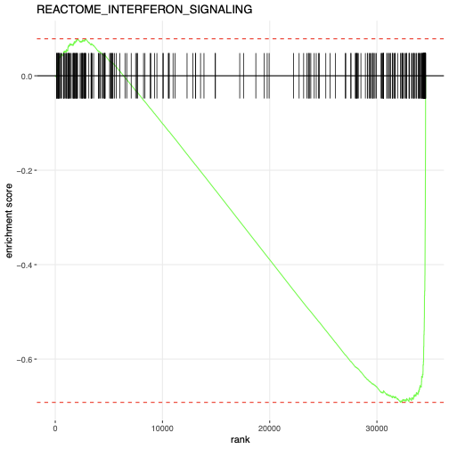

# Use Case: RNA-Seq Analysis

## Overview

This use case demonstrates how to use Coala to perform query-driven RNA-Seq analysis: downloading data from GEO, describing study design information, performing differential gene expression (DEG) analysis, downloading curated gene sets from MSigDB, running Gene Set Enrichment Analysis (GSEA) with canonical pathways, and generating enrichment plots for specified pathways. We'll use the GSE164141 dataset as an example, which contains RNA-Seq data from BT549 triple-negative breast cancer cells comparing MUC1-C silenced (treatment) vs control conditions.

## Setup

### MCP Server Configuration

Create an MCP server with RNA-Seq analysis tools as shown in `examples/RNA-Seq/RNA-Seq_mcp.py`:

```python
from coala.mcp_api import mcp_api
import os
base_dir = os.path.dirname(__file__)

mcp = mcp_api(host='0.0.0.0', port=8000)
mcp.add_tool(os.path.join(base_dir, 'getGEOs.cwl'), 'getGEOs', read_outs=False)
mcp.add_tool(os.path.join(base_dir, 'DEG.cwl'), 'DEG', read_outs=False)
mcp.add_tool(os.path.join(base_dir, 'pathdb.cwl'), 'pathdb', read_outs=False)
mcp.add_tool(os.path.join(base_dir, 'gsea.cwl'), 'gsea', read_outs=False)
mcp.add_tool(os.path.join(base_dir, 'plotGSEA.cwl'), 'plotGSEA', read_outs=False)
mcp.serve()
```

This server exposes five tools:
- **`getGEOs`**: Downloads sample metadata and expression matrices from GEO using [GEOquery](#geoquery)
- **`DEG`**: Performs differential expression analysis using [DESeq2](#deseq2)
- **`pathdb`**: Downloads pathway gene sets from MSigDB
- **`gsea`**: Runs Gene Set Enrichment Analysis using [fgsea](#fgsea)
- **`plotGSEA`**: Creates enrichment plots for specific pathways

### MCP Client Configuration

Configure your MCP client (e.g., in Cursor) to connect to the server:

```json
{
    "mcpServers": {
        "rna-seq": {
            "command": "python",
            "args": ["/path/to/examples/RNA-Seq/RNA-Seq_mcp.py"]
        }
    }
}
```

Note: Replace `/path/to/examples/RNA-Seq/RNA-Seq_mcp.py` with the actual path to the `RNA-Seq_mcp.py` file in your workspace.

## Use Case Workflow

### Step 1: Download GEO Dataset and Describe Study Design

**User Query:**

> download GSE164141 dataset and describe the study design


**Tool Invocation:**
```json
{
  "tool": "getGEOs",
  "parameters": {
    "geo": "GSE164141"
  }
}
```

**Tool Response:**
```json
{
  "mfile": {
    "basename": "GSE164141_series_matrix.txt.gz",
    "size": 2466
  },
  "sfile": {
    "basename": "GSE164141_BT549_RawCounts_Matrix.csv.gz",
    "size": 443412
  },
  "tool_name": "getGEOs",
  "tool_version": "quay.io/biocontainers/bioconductor-geoquery:2.74.0--r44hdfd78af_0"
}
```

**Chat Response:**

> Successfully downloaded the data for **GSE164141** and extracted study design information. Here are the files retrieved:
>
> **1. Series Matrix File (Sample Information):**
> - File: `GSE164141_series_matrix.txt.gz`
> - Size: 2,466 bytes
> - Contains: Sample metadata, platform information, and experimental design details
>
> **2. Count Matrix File (Supplementary Data):**
> - File: `GSE164141_BT549_RawCounts_Matrix.csv.gz`
> - Size: 443,412 bytes
> - Contains: Raw counts matrix for BT549 cell line RNA-seq data
>
> **Study Design Overview:**
>
> **Study Title:** "MUC1-C integrates activation of the IFN-γ pathway with suppression of the tumor immune microenvironment in triple-negative breast cancer"
>
> **GEO Accession:** GSE164141  
> **Study Type:** Expression profiling by high throughput sequencing (RNA-Seq)
>
> **Experimental Design:**
> - **Study Type:** Comparative analysis of MUC1-C silencing effects on global transcriptional profiles
> - **Comparison:** Treatment (MUC1-C silenced) vs Control (MUC1-C active)
> - **Biological Question:** Effects of MUC1-C silencing on global transcriptional profiles in human TNBC cells
> - **Cell Line:** BT-549 (triple-negative breast cancer cell line, female, Homo sapiens)
>
> **Treatment Conditions:**
> - **Control Group (DOXminus):** Cells treated with 0.1% DMSO (vehicle control) - 3 biological replicates (GSM4998116, GSM4998117, GSM4998118)
> - **Treatment Group (DOXplus):** Cells treated with 500 ng/ml doxycycline to induce MUC1-C silencing via shRNA (MISSION shRNA TRCN0000122938) - 3 biological replicates (GSM4998119, GSM4998120, GSM4998121)
> - **Total Samples:** 6 samples (3 control + 3 treatment)
>
> **Methodology:**
> - **Sequencing Platform:** Illumina HiSeq 2500
> - **Library Preparation:** TruSeq Stranded mRNA (Illumina)
> - **Genome Build:** GRCh38.p7 (GRCh38.74)
> - **Mapping:** STAR (version 2.7.3a) to human genome
> - **Gene Annotation:** GENCODE version 25
> - **Quantification:** STAR QuantMode (GeneCounts) function
>

### Step 2: Differential Expression Analysis

**User Query:**

> perform differential expression analysis between treatment and control groups

**Tool Invocation:**
```json
{
  "tool": "DEG",
  "parameters": {
    "counts": "/coala/examples/RNA-Seq/GSE164141/GSE164141_BT549_RawCounts_Matrix.csv.gz",
    "group": "control,control,control,treatment,treatment,treatment"
  }
}
```

**Tool Response:**
```json
{
  "deg": {
    "location": "/coala/examples/RNA-Seq/GSE164141/DEG_treatment_control.csv",
    "basename": "DEG_treatment_control.csv",
    "size": 4570091,
    "checksum": "sha1$81f4b3ca39a830731ad712734364290f9a9b29d3"
  },
  "tool_name": "DEG",
  "tool_version": "quay.io/biocontainers/bioconductor-deseq2:1.46.0--r44he5774e6_1"
}
```

**Chat Response:**

> The differential expression analysis completed successfully.
>
> **DEG Analysis Output:**
> - File: `DEG_treatment_control.csv`
> - Size: 4,570,091 bytes (~4.4 MB)
>
> **Analysis Summary:**
> - **Total genes analyzed:** 56,002
> - **Genes with valid results:** 25,467 (45.5%)
> - **Significantly DE genes (padj < 0.05):** 10,321 genes
>   - **Upregulated:** 4,789 genes
>   - **Downregulated:** 5,532 genes
> - **Significantly DE genes (padj < 0.01):** 8,896 genes
>
> **Top Downregulated Genes (MUC1-C silencing):**
> - CXCL10 (log2FC: -12.86) - chemokine, immune response
> - RSAD2 (log2FC: -11.13) - antiviral response
> - OAS2 (log2FC: -10.22) - antiviral response
> - OAS1 (log2FC: -9.49) - antiviral response
> - IFI44L (log2FC: -9.42) - interferon-induced
>
> **Biological Interpretation:**
> MUC1-C silencing shows strong effects on immune-related pathways. Many downregulated genes are interferon-stimulated genes (ISGs) and antiviral response genes, consistent with the study's focus on immune microenvironment modulation.
>
> **Output Columns:**
> - `baseMean`: Average normalized count across all samples
> - `log2FoldChange`: Log2 fold change (treatment/control)
> - `lfcSE`: Standard error of the log2 fold change
> - `stat`: Wald test statistic
> - `pvalue`: Raw p-value
> - `padj`: Adjusted p-value (Benjamini-Hochberg correction)

### Step 3: Download Curated Gene Sets from MSigDB

**User Query:**

> download curated gene sets C2 from Molecular Signatures Database

**Tool Invocation:**
```json
{
  "tool": "pathdb",
  "parameters": {
    "species": "Homo sapiens",
    "collection": "C2"
  }
}
```

**Tool Response:**
```json
{
  "pathway": {
    "location": "/coala/examples/RNA-Seq/GSE164141/Homosapiens_C2_pathway.txt",
    "basename": "Homosapiens_C2_pathway.txt",
    "size": 4195065,
    "checksum": "sha1$2f806230683ff6c7207163bfc56015e40e11ac0b"
  },
  "tool_name": "pathdb",
  "tool_version": "hubentu/gsea"
}
```

**Chat Response:**

> Successfully downloaded curated gene sets from MSigDB.
>
> **Pathway Database Output:**
> - File: `Homosapiens_C2_pathway.txt`
> - Size: 4,195,065 bytes (~4.0 MB)
> - Species: Homo sapiens
>
> **About C2 Collection:**
> The C2 collection contains **curated gene sets** from MSigDB, which includes:
> - Canonical pathways from KEGG, Reactome, BioCarta, Pathway Interaction Database
> - Published gene signatures from scientific literature
> - **Total pathways:** 7,561 gene sets
>
> Each row in the file contains a pathway name followed by gene symbols, ready for use in Gene Set Enrichment Analysis (GSEA). The collection includes canonical pathways such as REACTOME_INTERFERON_SIGNALING, KEGG_RIBOSOME, and many others.

### Step 4: Gene Set Enrichment Analysis with Canonical Pathways

**User Query:**

> perform GSEA on canonical pathways

**Tool Invocation:**
```json
{
  "tool": "gsea",
  "parameters": {
    "deg_res": "/coala/examples/RNA-Seq/GSE164141/DEG_treatment_control.csv",
    "pathways": "/coala/examples/RNA-Seq/GSE164141/Homosapiens_C2_pathway.txt",
    "rank_col": "stat",
    "pvalue": 0.01
  }
}
```

**Tool Response:**
```json
{
  "gsea": {
    "location": "/coala/examples/RNA-Seq/GSE164141/gsea_ranked.csv",
    "basename": "gsea_ranked.csv",
    "size": 1172842,
    "checksum": "sha1$03076954c5d61cda5b2af688e3b88b8454183797"
  },
  "tool_name": "gsea",
  "tool_version": "hubentu/fgsea:1.32.2"
}
```

**Chat Response:**

> The GSEA analysis completed successfully.
>
> **GSEA Analysis Output:**
> - File: `gsea_canonical_pathways.csv`
> - Size: 1,172,842 bytes (~1.1 MB)
>
> **Analysis Summary:**
> - **Total significant pathways (padj < 0.01):** 1,081 pathways
> - **Canonical pathways (KEGG/Reactome/BioCarta/PID):** 281 pathways
>   - **Enriched in treatment (MUC1-C silenced):** 182 pathways
>   - **Enriched in control (MUC1-C active):** 99 pathways
>
> **Top Canonical Pathways Enriched in Treatment:**
> 1. REACTOME_METABOLISM_OF_RNA (NES: 2.229)
> 2. REACTOME_TRANSLATION (NES: 2.593)
> 3. REACTOME_RRNA_PROCESSING (NES: 2.603)
> 4. KEGG_RIBOSOME (NES: 2.576)
> 5. KEGG_OXIDATIVE_PHOSPHORYLATION (NES: 2.507)
>
> **Top Canonical Pathways Enriched in Control:**
> 1. REACTOME_CYTOKINE_SIGNALING_IN_IMMUNE_SYSTEM (NES: -1.889)
> 2. REACTOME_INTERFERON_SIGNALING (NES: -2.048)
> 3. REACTOME_INTERFERON_ALPHA_BETA_SIGNALING (NES: -2.265)
> 4. REACTOME_INTERFERON_GAMMA_SIGNALING (NES: -2.147)
> 5. REACTOME_INNATE_IMMUNE_SYSTEM (NES: -1.489)
>
> **Biological Interpretation:**
> - **MUC1-C silencing** enhances canonical metabolic and cell cycle pathways (translation, RNA processing, oxidative phosphorylation)
> - **MUC1-C activity** maintains canonical immune pathways (interferon signaling, cytokine signaling, innate immunity)
> - These findings support the hypothesis that MUC1-C suppresses immune responses in TNBC cells

### Step 5: Generate Enrichment Plot

**User Query:**

> plot the REACTOME_INTERFERON_SIGNALING pathway's enrichment result

**Tool Invocation:**
```json
{
  "tool": "plotGSEA",
  "parameters": {
    "pathway_plot": "REACTOME_INTERFERON_SIGNALING",
    "pathways": "/coala/examples/RNA-Seq/GSE164141/Homosapiens_C2_pathway.txt",
    "deg_res": "/coala/examples/RNA-Seq/GSE164141/DEG_treatment_control.csv",
    "rank_col": "stat"
  }
}
```

**Tool Response:**
```json
{
  "gsea_plot": {
    "location": "/coala/examples/RNA-Seq/GSE164141/REACTOME_INTERFERON_SIGNALING.pdf",
    "basename": "REACTOME_INTERFERON_SIGNALING.pdf",
    "size": 9141,
    "checksum": "sha1$38a0808a458d7cc8a222c9c17879f53333abd0b8"
  },
  "tool_name": "plotGSEA",
  "tool_version": "hubentu/gsea"
}
```

**Chat Response:**

> Successfully created the enrichment plot for the REACTOME_INTERFERON_SIGNALING pathway.
>
> **GSEA Enrichment Plot Output:**
> - File: `REACTOME_INTERFERON_SIGNALING.pdf`
> - Size: 9,141 bytes (~9 KB)
>
> **Pathway Details:**
> - **Normalized Enrichment Score (NES):** -2.048
> - **Enrichment Score (ES):** -0.692
> - **Adjusted p-value (padj):** 1.50e-12
> - **Number of genes:** 256 genes
>
> **Interpretation:**
> - Negative NES (-2.048) indicates this pathway is enriched in the **control group (MUC1-C active)**
> - Interferon signaling genes are **downregulated when MUC1-C is silenced**
> - The enrichment plot shows:
>   - **X-axis:** Genes ranked by differential expression statistic (from most downregulated on the left to most upregulated on the right)
>   - **Y-axis:** Running enrichment score
>   - **Vertical lines:** Positions of genes in this pathway along the ranked list
>   - The enrichment curve peaks on the left (downregulated side), indicating pathway genes are concentrated among downregulated genes
>
> This visualization supports the finding that MUC1-C suppresses interferon signaling in TNBC cells, consistent with immune evasion mechanisms.

**Generated Enrichment Plot:**



*Figure: GSEA enrichment plot for the REACTOME_INTERFERON_SIGNALING pathway showing the running enrichment score, gene hits, and ranking metric distribution. The negative NES indicates enrichment in the control group (MUC1-C active), meaning interferon signaling is suppressed when MUC1-C is silenced.*

## Key Benefits

1. **Natural Language Interface**: End-to-end analysis from data download to visualization accessible through simple queries
3. **Automatic Tool Chaining**: Results from one step are automatically used in subsequent steps
3. **Reproducible Analysis**: All tools run in containerized environments with specified versions
4. **Human-in-the-Loop Analysis**: Users maintain full control throughout the analysis process. Through natural language interaction without modifying code, you can adjust p-value cutoffs for significance thresholds, specify pathways of interest for focused analysis, modify sample groupings, select different pathway collections based on biological context, and generate custom visualizations for specific pathways

## Technical Details

### Tool Execution

All tools execute in Docker containers as specified in their CWL definitions:
- **[GEOquery](#geoquery)**: Bioconductor package for GEO data retrieval (v2.74.0)
- **[DESeq2](#deseq2)**: Bioconductor package for differential expression (v1.46.0)
- **[fgsea](#fgsea)**: Fast GSEA implementation for pathway analysis (v1.32.2)

### Data Flow

1. GEO dataset (GSE164141) is downloaded with metadata and count matrix, and study design information is extracted from the series matrix file
2. Count matrix is normalized and analyzed by [DESeq2](#deseq2) comparing treatment (MUC1-C silenced) vs control groups
3. Curated gene sets (C2 collection) are downloaded from MSigDB
4. Genes are ranked by test statistic for GSEA analysis by [fgsea](#fgsea), and canonical pathways (KEGG, Reactome, BioCarta, PID) are identified and analyzed
5. Pathway enrichment is computed and visualized for specific pathways of interest

### Output Files

| Step | File | Description |
|------|------|-------------|
| 1 | `GSE164141_series_matrix.txt.gz` | Sample metadata and experimental design |
| 1 | `GSE164141_BT549_RawCounts_Matrix.csv.gz` | Raw count matrix |
| 2 | `DEG_treatment_control.csv` | Differential expression results (4.4 MB) |
| 3 | `Homosapiens_C2_pathway.txt` | Curated gene sets from MSigDB C2 collection (4.0 MB) |
| 4 | `gsea_canonical_pathways.csv` | GSEA enrichment results for canonical pathways (1.1 MB) |
| 5 | `REACTOME_INTERFERON_SIGNALING.pdf` | Enrichment plot for interferon signaling pathway |

## Extending the Workflow

This use case can be extended to, including but not limited to:
- Analyze multiple GEO datasets
- Apply different DEG methods
- Generate heatmaps of top differentially expressed genes
- Use different pathway collections
- Perform over-representation analysis (ORA) in addition to GSEA
- Integrate RNA-Seq and ATAC-Seq 

All of these extensions can be implemented by adding additional CWL tools to the MCP server and querying them through natural language.

## Reference

<a id="geoquery"></a>
GEOquery
https://github.com/seandavi/GEOquery

<a id="deseq2"></a>
DESeq2
https://github.com/thelovelab/DESeq2

<a id="fgsea"></a>
fgsea
https://github.com/alserglab/fgsea
