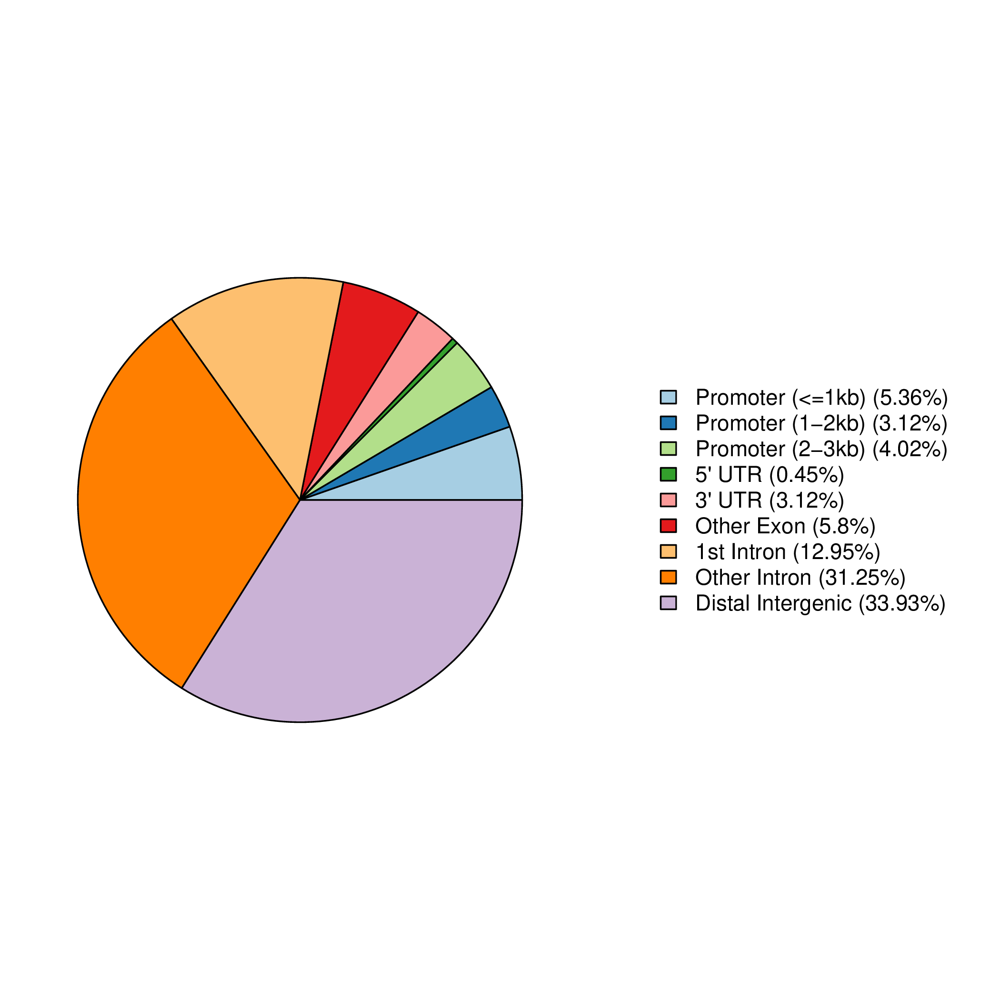
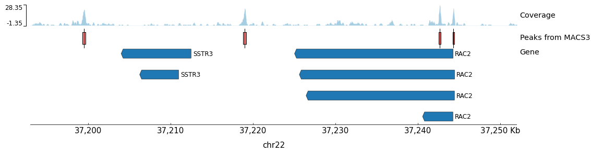

# Use Case: ATAC-Seq Peak Calling and Visualization

## Overview

This use case demonstrates how to use Coala to perform ATAC-Seq peak calling and visualization. We'll use macs3 to identify open chromatin regions from ATAC-Seq data ([MACS3](#macs3)), ChIPseeker to annotate peaks with genomic features ([ChIPseeker](#chipseeker)), and pyGenomeTracks to visualize the peaks alongside gene annotations ([pyGenomeTracks](#pygenometracks)).

### What is ATAC-Seq?

In many eukaryotic organisms, such as humans, the genome is tightly packed and organized with the help of nucleosomes (chromatin). A nucleosome is a complex formed by eight histone proteins that is wrapped with ~147bp of DNA. When the DNA is being actively transcribed into RNA, the DNA will be opened and loosened from the nucleosome complex.

**A**ssay for **T**ransposase-**A**ccessible **C**hromatin using **seq**uencing (ATAC-Seq) is a method to investigate the accessibility of chromatin and thus a method to determine regulatory mechanisms of gene expression. The method can help identify:
- **Promoter regions**: DNA regions close to the transcription start site (TSS) containing binding sites for transcription factors
- **Enhancers**: DNA regions that can be located up to 1 Mb downstream or upstream of the promoter that increase transcription
- **Silencers**: DNA regions that decrease or inhibit gene expression

### How ATAC-Seq Works

With ATAC-Seq, to find accessible (open) chromatin regions, the genome is treated with a hyperactive derivative of the **Tn5 transposase**. During ATAC-Seq:

1. The modified Tn5 inserts DNA sequences corresponding to truncated Nextera adapters into open regions of the genome
2. Concurrently, the DNA is sheared by the transposase activity
3. The read library is then prepared for sequencing, including PCR amplification with full Nextera adapters

ATAC-Seq has become popular for identifying accessible regions of the genome as it's easier, faster, and requires fewer cells than alternative techniques such as FAIRE-Seq and DNase-Seq.

### About the Dataset

This tutorial uses data from the study of [Buenrostro et al. 2013](https://doi.org/10.1038/nmeth.2688), the first paper on the ATAC-Seq method. The data is from a human lymphoblastoid cell line called **GM12878** (purified CD4+ T cells). 

For this example, we use a subset of reads that map to **chromosome 22** (`SRR891268_chr22.bed`), which provides a manageable dataset size while still demonstrating the complete workflow.

## Setup

### MCP Server Configuration

Create an MCP server with ATAC-Seq analysis tools as shown in `examples/atac-seq/atac_question.py`:

```python
from coala.mcp_api import mcp_api
import os
base_dir = os.path.dirname(__file__)

mcp = mcp_api(host='0.0.0.0', port=8000)
mcp.add_tool(os.path.join(base_dir, 'macs3_callpeak.cwl'))
mcp.add_tool(os.path.join(base_dir, 'peakAnno.cwl'))
mcp.add_tool(os.path.join(base_dir, 'pygenometracks_peak.cwl'))
mcp.serve()
```

This server exposes three tools:
- **`macs3_callpeak`**: Calls peaks from ATAC-Seq/ChIP-Seq data using macs3
- **`ChiPSeeker`**: Annotates peaks with genomic features using ChIPseeker
- **`pygenometracks_peak`**: Visualizes peaks and coverage tracks using pyGenomeTracks

### MCP Client Configuration

Configure your MCP client (e.g., in Cursor) to connect to the server:

```json
{
    "mcpServers": {
        "atacseq": {
            "command": "python",
            "args": ["/path/to/examples/atac-seq/atac_question.py"]
        }
    }
}
```

Note: Replace `/path/to/examples/atac-seq/atac_question.py` with the actual path to the `atac_question.py` file in your workspace.

## Use Case Workflow

### Step 1: Call Peaks with macs3

**User Query:**
> Here is a treatment bed file for the ATAC-seq data: SRR891268_chr22.bed. Call peaks for the treatment bed file. According to the tutorial, the extension size should be 200bp and shift size should be -100. Do not build the shifting model. Keep all duplicate tags. Save extended fragment pileup and local lambda tracks at every bp into a bedGraph file. Use a more sophisticated signal processing approach to find subpeak summits in each enriched peak region.
>
Reference: [Galaxy ATAC-seq tutorial](#galaxy-atac-seq-tutorial).

**Tool Invocation:**
```json
{
  "tool": "macs3_callpeak",
  "parameters": {
    "treatment": "/path/to/SRR891268_chr22.bed",
    "extsize": 200,
    "shift": -100,
    "nomodel": true,
    "keepdup": "all",
    "bdg": true,
    "summits": true,
    "name": "SRR891268_chr22"
  }
}
```

**Tool Response:**
```json
{
  "controlBdg": {
    "basename": "SRR891268_chr22_control_lambda.bdg",
    "size": 16683479
  },
  "narrowPeak": {
    "basename": "SRR891268_chr22_peaks.narrowPeak",
    "size": 18176
  },
  "summitsBed": {
    "basename": "SRR891268_chr22_summits.bed",
    "size": 12641
  },
  "teatBdg": {
    "basename": "SRR891268_chr22_treat_pileup.bdg",
    "size": 16653579
  },
  "xlsPeak": {
    "basename": "SRR891268_chr22_peaks.xls",
    "size": 20791
  },
  "tool_name": "macs3_callpeak",
  "tool_version": "quay.io/biocontainers/macs3:3.0.3--py39h0699b22_0"
}
```

**Chat Response:**
> macs3 peak calling completed successfully. Here are the output files generated:
>
> | Output | File | Size |
> |--------|------|------|
> | **narrowPeak** | `SRR891268_chr22_peaks.narrowPeak` | 18.2 KB |
> | **Summits BED** | `SRR891268_chr22_summits.bed` | 12.6 KB |
> | **Peak XLS** | `SRR891268_chr22_peaks.xls` | 20.8 KB |
> | **Treatment bedGraph** | `SRR891268_chr22_treat_pileup.bdg` | 16.7 MB |
> | **Control lambda bedGraph** | `SRR891268_chr22_control_lambda.bdg` | 16.7 MB |
>
> All your specified parameters were applied:
> - Extension size: 200bp
> - Shift size: -100bp
> - No model building (`--nomodel`)
> - Keep all duplicate tags (`--keep-dup all`)
> - bedGraph output enabled (`--bdg`)
> - Subpeak summits detection enabled (`--call-summits`)
> ```
> Tool Invocation Summary:
> tool_name: macs3_callpeak
> tool_version: quay.io/biocontainers/macs3:3.0.3--py39h0699b22_0
> ```

### Step 2: Count Peaks

**User Query:**
> how many narrow peaks did we get?

**Chat Response:**
> The narrowPeak file has **224 peaks**. The file contains no header, so each line represents a peak in BED6+4 format with coordinates, scores, and statistics.

### Step 3: Call Peaks with Q-value Filter

**User Query:**
> set the q value to 0.001 and rerun peak calling, summarize the number of peaks.

**Tool Invocation:**
```json
{
  "tool": "macs3_callpeak",
  "parameters": {
    "treatment": "/path/to/SRR891268_chr22.bed",
    "extsize": 200,
    "shift": -100,
    "nomodel": true,
    "keepdup": "all",
    "bdg": true,
    "summits": true,
    "qvalue": 0.001,
    "name": "SRR891268_chr22_q001"
  }
}
```

**Tool Response:**
```json
{
  "narrowPeak": {
    "basename": "SRR891268_chr22_q001_peaks.narrowPeak",
    "size": 11021
  },
  "summitsBed": {
    "basename": "SRR891268_chr22_q001_summits.bed",
    "size": 7813
  },
  "xlsPeak": {
    "basename": "SRR891268_chr22_q001_peaks.xls",
    "size": 13000
  },
  "teatBdg": {
    "basename": "SRR891268_chr22_q001_treat_pileup.bdg",
    "size": 16653579
  },
  "controlBdg": {
    "basename": "SRR891268_chr22_q001_control_lambda.bdg",
    "size": 16683479
  },
  "tool_name": "macs3_callpeak",
  "tool_version": "quay.io/biocontainers/macs3:3.0.3--py39h0699b22_0"
}
```

**Chat Response:**
> Peak calling completed with q-value cutoff of 0.001.
>
> **Total peaks found:** 128
>
> **Comparison:**
> - Original run (default q-value = 0.05): 224 peaks
> - With q-value = 0.001: 128 peaks
> - Peaks filtered out: 96 (q-value > 0.001)

### Step 4: Annotate Peaks with ChiPSeeker

**User Query:**
> Annotate the narrow peaks, SRR891268_chr22_peaks.narrowPeak.

**Tool Invocation:**
```json
{
  "tool": "ChiPSeeker",
  "parameters": {
    "peak": "/path/to/SRR891268_chr22_peaks.narrowPeak"
  }
}
```

**Tool Response:**
```json
{
  "ann": {
    "basename": "SRR891268_chr22_peaks.narrowPeak_peakAnno.csv",
    "size": 42281
  },
  "pie": {
    "basename": "SRR891268_chr22_peaks.narrowPeak_AnnoPie.pdf",
    "size": 5813
  },
  "tool_name": "ChiPSeeker",
  "tool_version": "quay.io/biocontainers/bioconductor-chipseeker:1.42.0--r44hdfd78af_0"
}
```

**Chat Response:**
> Peak annotation completed successfully. Generated files:
>
> 1. **SRR891268_chr22_peaks.narrowPeak_peakAnno.csv** (42K) - Annotation results in CSV format with:
>    - Peak coordinates (seqnames, start, end, width)
>    - Peak metadata (V4-V10 from narrowPeak)
>    - Genomic annotation (annotation column: e.g., "Distal Intergenic", "Intron")
>    - Nearest gene information (geneId, transcriptId, distanceToTSS)
>    - Gene coordinates and strand
>
> 2. **SRR891268_chr22_peaks.narrowPeak_AnnoPie.pdf** (5.7K) - Pie chart showing the distribution of peaks across genomic features
>
> The annotation shows peaks are annotated with their genomic context, including whether they fall in promoters, introns, exons, or intergenic regions, along with the nearest gene and distance to the transcription start site (TSS).

**Peak Annotation Results Preview:**

The following table shows a preview of the peak annotation results:

| Peak ID | Chromosome | Start | End | Width | Annotation | Gene ID | Transcript ID | Distance to TSS |
|---------|------------|-------|-----|-------|------------|---------|---------------|-----------------|
| SRR891268_chr22_peak_1 | chr1 | 629839 | 630055 | 217 | Distal Intergenic | 729759 | uc010nxv.2 | -7805 |
| SRR891268_chr22_peak_2 | chr1 | 633891 | 634174 | 284 | Distal Intergenic | 729759 | uc010nxv.2 | -11857 |
| SRR891268_chr22_peak_3 | chr10 | 99659162 | 99659391 | 230 | Intron (uc001kot.2/55118, intron 6 of 11) | 55118 | uc001kot.2 | 36732 |
| SRR891268_chr22_peak_4 | chr11 | 4393681 | 4393880 | 200 | Distal Intergenic | 143496 | uc010qye.2 | -4065 |
| SRR891268_chr22_peak_5 | chr12 | 88142166 | 88142365 | 200 | Distal Intergenic | 400058 | uc021rbq.1 | 36123 |
| SRR891268_chr22_peak_6 | chr13 | 100674844 | 100675043 | 200 | Distal Intergenic | 7546 | uc001von.3 | 40818 |
| SRR891268_chr22_peak_7 | chr17 | 22521277 | 22521506 | 230 | Distal Intergenic | 100462977 | uc002gzb.2 | 498840 |
| SRR891268_chr22_peak_8 | chr20 | 63009184 | 63009383 | 200 | Distal Intergenic | 140849 | uc002yio.1 | 87446 |
| SRR891268_chr22_peak_9 | chr22 | 17084749 | 17085091 | 343 | Promoter (1-2kb) | 387590 | uc002zls.1 | 1948 |

**Peak Annotation Visualization:**


*Figure: ChIPseeker pie chart showing the distribution of ATAC-Seq peaks across genomic features. The chart displays the percentage of peaks falling into different genomic regions such as promoters, introns, exons, 5' UTR, 3' UTR, and intergenic regions, providing insight into where accessible chromatin regions are located relative to gene structures.*

### Step 5: Visualize Peaks with pyGenomeTracks

**User Query:**
> We want to visualize the narrow peaks in the chr22:37,193,000-37,252,000 region using pygenometracks. Use the chr22_gene.bed file as the gene annotation. The treatment bed graph from callpeak as the bedgraph coverage file. Use the peak.ini file as the configuration file.

**Tool Invocation:**
```json
{
  "tool": "pygenometracks_peak",
  "parameters": {
    "peak": "/path/to/SRR891268_chr22_peaks.narrowPeak",
    "bedgraph": "/path/to/SRR891268_chr22_treat_pileup.bdg",
    "gene": "/path/to/chr22_gene.bed",
    "tracks": "/path/to/peak.ini",
    "region": "chr22:37,193,000-37,252,000",
    "outname": "SRR891268_chr22_region_37193000_37252000.png"
  }
}
```

**Tool Response:**
```json
{
  "trackplot": {
    "basename": "SRR891268_chr22_region_37193000_37252000.png",
    "size": 26927
  },
  "tool_name": "pygenometracks_peak",
  "tool_version": "quay.io/biocontainers/pygenometracks:3.9--pyhdfd78af_0"
}
```

**Chat Response:**
> Visualization generated successfully. The track plot for the region chr22:37,193,000-37,252,000 has been created and saved as:
>
> **SRR891268_chr22_region_37193000_37252000.png** (27K)
>
> The visualization includes:
> - **Coverage track**: Treatment bedGraph coverage from the peak calling results
> - **Peaks track**: Narrow peaks from MACS3 in box format
> - **Gene annotation track**: Gene annotations from chr22_gene.bed
>
> The plot uses the configuration from `peak.ini` and shows the genomic tracks for the specified region.

**Generated Peak Visualization:**



*Figure: pyGenomeTracks output showing the chr22:37,193,000-37,252,000 region. The plot displays ATAC-Seq coverage (top track), called peaks (middle track), and gene annotations (bottom track). The peaks correspond to accessible chromatin regions identified by MACS3.*

## Key Benefits

1. **ATAC-Seq Optimized Parameters**: The workflow uses ATAC-Seq-specific parameters (shift -100, extsize 200) as recommended by standard tutorials
2. **Complete Output Files**: Generates all essential outputs including peaks, summits, and bedGraph files for downstream analysis
3. **Quality Control**: Easy filtering of peaks by q-value thresholds for downstream analysis
4. **Peak Annotation**: Automatic annotation of peaks with genomic features and nearest genes
5. **Integrated Visualization**: Seamlessly visualizes peaks with coverage and gene annotations
6. **Natural Language Interface**: Complex peak calling accessible through simple queries
7. **Automatic Tool Chaining**: Results from peak calling are automatically used for visualization and annotation
8. **Reproducible Analysis**: All tools run in containerized environments with specified versions
9. **Human-in-the-Loop Analysis**: Users can adjust parameters like extension size, shift, duplicate handling, q-value thresholds, and visualization regions through natural language

## Technical Details

### Tool Execution

All tools execute in Docker containers as specified in their CWL definitions:
- **macs3**: Model-based Analysis of ChIP-Seq (v3.0.3)
- **ChIPseeker**: ChIP peak annotation (v1.42.0)
- **pyGenomeTracks**: Genome browser track visualization (v3.9)

### macs3 Parameters Explained

| Parameter | Value | Description |
|-----------|-------|-------------|
| `extsize` | 200 | Extends reads to 200bp fragments |
| `shift` | -100 | Shifts reads by -100bp (centers on Tn5 cut site) |
| `nomodel` | true | Skips fragment size estimation |
| `keepdup` | all | Retains all duplicate reads |
| `bdg` | true | Outputs bedGraph files for visualization |
| `summits` | true | Identifies subpeak summits |
| `qvalue` | 0.001 | Minimum FDR threshold for peak calling (default: 0.05) |

### Data Flow

1. ATAC-Seq reads (BED format) are processed by macs3
2. macs3 identifies enriched regions (peaks) representing open chromatin
3. Peak summits are identified for precise accessibility positions
4. bedGraph coverage tracks are generated for visualization
5. Q-value filtering is applied during peak calling to control false discovery rate
6. ChIPseeker annotates peaks with genomic features (promoters, introns, exons, intergenic) and nearest genes
7. pyGenomeTracks combines peaks, coverage, and gene annotations into a single plot

### Output Files

| Step | File | Description |
|------|------|-------------|
| 1 | `*_peaks.narrowPeak` | Peak locations (BED6+4 format) |
| 1 | `*_summits.bed` | Peak summit positions |
| 1 | `*_peaks.xls` | Detailed peak statistics |
| 1 | `*_treat_pileup.bdg` | Treatment coverage (bedGraph) |
| 1 | `*_control_lambda.bdg` | Local background estimate |
| 3 | `*_peaks.narrowPeak` | Peaks filtered by q-value threshold during calling |
| 4 | `*_peakAnno.csv` | Peak annotation with genomic features |
| 4 | `*_AnnoPie.pdf` | Pie chart of peak distribution by feature |
| 5 | `*.png` | Genome browser visualization |

## Extending the Workflow

This use case can be extended to:
- Compare peaks between conditions using differential peak analysis
- Perform motif analysis on peak sequences
- Integrate with RNA-Seq data for multi-omic analysis
- Generate signal heatmaps around transcription start sites
- Identify transcription factor footprints within peaks
- Export peaks to UCSC Genome Browser or IGV
- Filter peaks by additional criteria (fold enrichment, p-value, etc.)

All of these extensions can be implemented by adding additional CWL tools to the MCP server and querying them through natural language.

## Reference

<a id="galaxy-atac-seq-tutorial"></a>
Galaxy ATAC-seq tutorial
https://galaxyproject.github.io/training-material/topics/epigenetics/tutorials/atac-seq/tutorial.html

<a id="macs3"></a>
MACS3
https://github.com/macs3-project/MACS

<a id="chipseeker"></a>
ChIPseeker
https://www.bioconductor.org/packages/release/bioc/html/ChIPseeker.html

<a id="pygenometracks"></a>
pyGenomeTracks
https://github.com/deeptools/pyGenomeTracks
