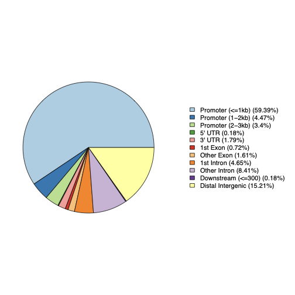
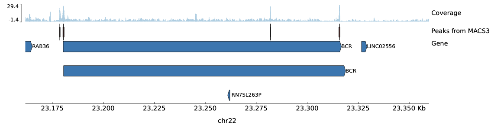

# Use Case: ATAC-Seq Analysis

## Overview

This use case demonstrates how to use Coala to perform query-driven ATAC-Seq analysis, including peak calling using ([MACS3](#macs3)), peak annotation using ([ChIPseeker](#chipseeker)), and peak visualization using ([pyGenomeTracks](#pygenometracks)). We will start with a BAM file for ATAC-seq data (BT549_Doxminus_chr22.bam); run MACS3 to call peaks using paired-end mode and summarize the results; adjust q-value cutoff to call a more stringent peak set; annotate peaks using ChIPSeeker to associate peaks with genomic features and nearest genes; and visualize peaks in a specific genomic region using pyGenomeTracks.

<!-- 
This use case demonstrates how to use Coala to perform query-driven ATAC-Seq analysis, We'll use macs3 to identify open chromatin regions from ATAC-Seq data ([MACS3](#macs3)), ChIPseeker to annotate peaks with genomic features ([ChIPseeker](#chipseeker)), and pyGenomeTracks to visualize the peaks alongside gene annotations ([pyGenomeTracks](#pygenometracks)).

### About the Dataset
-->


## Setup

### MCP Server Configuration

Start an MCP server with ATAC-Seq analysis tools as shown in `examples/atac-seq/atac_question.py`:

```python
from coala.mcp_api import mcp_api
import os
base_dir = os.path.dirname(__file__)

mcp = mcp_api(host='0.0.0.0', port=8000)
mcp.add_tool(os.path.join(base_dir, 'macs3_callpeak.cwl'))
mcp.add_tool(os.path.join(base_dir, 'peakAnno.cwl'))
mcp.add_tool(os.path.join(base_dir, 'pygenometracks_peak.cwl'))
mcp.serve()
```

This server exposes three tools:
- **`macs3_callpeak`**: Calls peaks from ATAC-Seq data using macs3
- **`ChIPSeeker`**: Annotates peaks with genomic features using ChIPseeker
- **`pygenometracks_peak`**: Visualizes peaks and coverage tracks alongside gene annotations using pyGenomeTracks

### MCP Client Configuration

Configure your MCP client (e.g., Claude Desktop, Cursor) to connect to the MCP server:

```json
{
    "mcpServers": {
        "atacseq": {
            "command": "python",
            "args": ["/path/to/examples/atac-seq/atac_question.py"]
        }
    }
}
```

Note: Replace `/path/to/examples/atac-seq/atac_question.py` with the actual path to the `atac_question.py` file in your workspace.

## Use Case Workflow

For demonstration purposes, we utilize human ATAC-Seq data from the BT-549 human triple negative breast cancer cell line ([Bhattacharya and et al.](https://doi.org/10.1158/1541-7786.MCR-21-0672)), using only the reads mapped to chromosome 22. The alignment file is in BAM format for the paired-end ATAC-seq library.

### Step 1: Call Peaks with macs3 and Summarize

**User Query:**
> Here is a BAM file for the ATAC-seq data: BT549_Doxminus_chr22.bam. Call peaks for the BAM file using paired end mode, and summarize the number of peaks. Use genome size of 5e7 which is approximately the size for human chromosome 22. Keep all duplicate tags. Save extended fragment pileup and local lambda tracks at every bp into a bedGraph file. Do not call subpeak summits.

**Chat Response:**

> Peak calling completed. Summary:
> 
> ## Peak Calling Results
> 
> **Number of peaks:** **815**
> 
> Peak calling was performed with:
> - **Input file:** BT549_Doxminus_chr22.bam
> - **Mode:** Paired-end (BAMPE format)
> - **Genome size:** 5e7 (50,000,000 bp for human chromosome 22)
> - **Duplicate handling:** All duplicate tags kept (`--keep-dup all`)
> - **BedGraph output:** Extended fragment pileup and local lambda tracks saved
> - **Subpeak summits:** Not called (as requested)
> 
> **Output files generated:**
> - `test_peaks.narrowPeak` - 815 peaks in BED6+4 format
> - `test_peaks.xls` - Detailed peak information table
> - `test_treat_pileup.bdg` - Treatment sample bedGraph file
> - `test_control_lambda.bdg` - Control lambda bedGraph file
> 
> The narrowPeak file contains 815 significantly enriched regions identified from the ATAC-seq data.

### Step 2: Rerun with More Stringent q-value Cutoff

**User Query:**
> Set a more stringent q value cutoff 0.001 and rerun peak calling, summarize the number of peaks.

**Chat Response:**

> ## Peak Calling Results with q-value = 0.001
> 
> **Number of peaks:** **559**
> 
> **Comparison:**
> - **Previous run (default q-value = 0.05):** 815 peaks
> - **Current run (q-value = 0.001):** 559 peaks
> - **Reduction:** 256 peaks (31.4% fewer)
> 
> The more stringent q-value cutoff (0.001) filters to only the most statistically significant peaks, reducing the count from 815 to 559.
> 
> **Parameters used:**
> - **Input file:** BT549_Doxminus_chr22.bam
> - **Mode:** Paired-end (BAMPE format)
> - **Genome size:** 5e7 (50,000,000 bp)
> - **Duplicate handling:** All duplicate tags kept
> - **Q-value cutoff:** 0.001 (more stringent)
> - **BedGraph output:** Enabled
> - **Subpeak summits:** Not called

### Step 3: Annotate Peaks with ChIPSeeker

**User Query:**
> Annotate the peak set from q-value cutoff 0.001.

**Chat Response:**

> ## Peak Annotation Summary
> 
> **Total peaks annotated:** 559
> 
> ### Annotation Distribution by Genomic Feature:
> 
> **Promoter regions (most common):**
> - **Promoter (≤1kb):** 332 peaks (59.4%)
> - **Promoter (1-2kb):** 25 peaks (4.5%)
> - **Promoter (2-3kb):** 19 peaks (3.4%)
> - **Total promoter-associated:** 376 peaks (67.3%)
> 
> **Other genomic features:**
> - **Distal Intergenic:** 85 peaks (15.2%)
> - **3' UTR:** 10 peaks (1.8%)
> - **Introns:** 60 peaks (10.7%) — various transcripts
> - **Exons:** 7 peaks (1.3%) — various transcripts
> - **5' UTR:** 1 peak (0.2%)
> - **Downstream (≤300bp):** 1 peak (0.2%)
> 
> ### Key Findings:
> 
> 1. **Strong promoter enrichment:** 67.3% of peaks are located in promoter regions (within 3kb of TSS), which is consistent with ATAC-seq detecting open chromatin near gene promoters.
> 2. **Intergenic regions:** 15.2% are in distal intergenic regions, likely representing enhancers or other regulatory elements.
> 3. **Gene body:** Approximately 12% are located within gene bodies (introns/exons/UTRs).
> 
> **Output files generated:**
> - `test_peaks.narrowPeak_peakAnno.csv` — Detailed annotation table with gene information
> - `test_peaks.narrowPeak_AnnoPie.pdf` — Pie chart visualization of annotation distribution
> 
> The annotation file includes gene IDs, transcript IDs, distances to TSS, and other genomic information for each peak.

**Peak Annotation Visualization:**



*Figure: ChIPseeker pie chart showing the distribution of ATAC-Seq peaks across various genomic features. The chart displays the percentage of peaks falling into different genomic regions such as promoters, introns, exons, 5' UTR, 3' UTR, and intergenic regions, providing insight into where accessible chromatin regions are located relative to gene structures.*


### Step 4: Visualize Peaks with pyGenomeTracks

**User Query:**
> let's visualize the peak in the chr22:23,161,760-23,359,701 region in a genome browser view.

**Chat Response:**

> ## Genome Browser Visualization
> 
> **Region:** chr22:23,161,760-23,359,701 (197,942 bp)
> 
> **Peaks in region:** 4 peaks
> 
> **Visualization file created:**
> - `chr22_23161760_23359701_visualization.png`
> 
> The visualization includes three tracks:
> 1. **Coverage track (bedGraph)** — ATAC-seq signal intensity across the region
> 2. **Peaks track** — Called peaks from MACS3 (q-value ≤ 0.001) shown as boxes
> 3. **Gene annotation track** — Gene annotations from chr22_gene.bed
> 
> The image has been saved to:
> `./BT549_Doxminus_chr22_region_visualization.png`
> 
> You can open this PNG file to view the genome browser tracks for the specified region, showing the ATAC-seq coverage, called peaks, and gene annotations.

**Generated Peak Visualization:**



*Figure: pyGenomeTracks output showing the chr22:23,161,760-23,359,701 region. The plot displays ATAC-Seq read coverage (top track), called peaks (middle track), and the gene annotations (bottom track). The peaks correspond to accessible chromatin regions identified by MACS3 with q-value ≤ 0.001.*

## Key Benefits

1. **ATAC-Seq Optimized Parameters**: The workflow uses ATAC-Seq-specific parameters (paired-end mode)
2. **Complete Output Files**: Generates all essential outputs including peaks, summits, and bedGraph files for downstream analysis
3. **Quality Control**: Easy filtering of peaks by q-value thresholds for downstream analysis
4. **Peak Annotation**: Automatic annotation of peaks with genomic features and nearest genes
5. **Integrated Visualization**: Seamlessly visualizes peaks with coverage and gene annotations
6. **Natural Language Interface**: Complex peak calling accessible through simple queries
7. **Automatic Tool Chaining**: Results from peak calling are automatically used for visualization and annotation
8. **Reproducible Analysis**: All tools run in containerized environments with specified versions
9. **Human-in-the-Loop Analysis**: Users can adjust parameters like q-value thresholds, fix issues during analysis, and visualization regions through natural language

## Technical Details

### Tool Execution

All tools execute in Docker containers as specified in their CWL definitions:
- **macs3**: Model-based Analysis of ChIP-Seq (v3.0.3)
- **ChIPseeker**: ChIP peak annotation (v1.42.0)
- **pyGenomeTracks**: Genome browser track visualization (v3.9)

### macs3 Parameters Explained

| Parameter | Value | Description |
|-----------|-------|-------------|
| `format` | BAMPE | Paired-end BAM format for ATAC-seq |
| `gsize` | 5e7 | The effective size of human chromosome 22 |
| `keepdup` | all | Retains all duplicate reads |
| `bdg` | true | Outputs bedGraph files for visualization |
| `summits` | false | Do not identify subpeak summits |
| `qvalue` | 0.001 | Minimum FDR threshold for peak calling (default: 0.05) |

### Data Flow

1. ATAC-Seq reads (BAM format) are processed by macs3 in paired-end mode
2. macs3 identifies enriched regions (peaks) representing open chromatin
3. bedGraph coverage tracks are generated for visualization
4. q-value tweaking is demonstrated during peak calling to control false discovery rate
5. ChIPseeker annotates peaks with genomic features (promoters, introns, exons, intergenic) and nearest genes
6. pyGenomeTracks combines peaks, coverage, and gene annotations into a single plot

### Output Files

| Step | File | Description |
|------|------|-------------|
| 1 | `*_peaks.narrowPeak` | Peak locations (BED6+4 format) |
| 1 | `*_peaks.xls` | Detailed peak statistics |
| 1 | `*_treat_pileup.bdg` | Treatment coverage (bedGraph) |
| 1 | `*_control_lambda.bdg` | Local background estimate |
| 2 | `*_peaks.narrowPeak` | Peaks filtered by q-value threshold during calling |
| 3 | `*_peakAnno.csv` | Peak annotation with genomic features |
| 3 | `*_AnnoPie.pdf` | Pie chart of peak distribution by feature |
| 4 | `*.png` | Genome browser visualization |

## Extending the Workflow

This use case can be extended to:
- Compare peaks between conditions using differential peak analysis
- Perform motif analysis on peak sequences
- Integrate with RNA-Seq data for multi-omic analysis
- Generate signal heatmaps around transcription start sites
- Identify transcription factor footprints within peaks
- Export peaks to UCSC Genome Browser or IGV
- Filter peaks by additional criteria (fold enrichment, p-value, etc.)

All of these extensions can be implemented by adding additional CWL tools to the MCP server and querying them through natural language.

## Reference

<a id="galaxy-atac-seq-tutorial"></a>
Galaxy ATAC-seq tutorial
https://galaxyproject.github.io/training-material/topics/epigenetics/tutorials/atac-seq/tutorial.html

<a id="macs3"></a>
MACS3
https://github.com/macs3-project/MACS

<a id="chipseeker"></a>
ChIPseeker
https://www.bioconductor.org/packages/release/bioc/html/ChIPseeker.html

<a id="pygenometracks"></a>
pyGenomeTracks
https://github.com/deeptools/pyGenomeTracks

<!--
### What is ATAC-Seq?

In many eukaryotic organisms, such as humans, the genome is tightly packed and organized with the help of nucleosomes (chromatin). A nucleosome is a complex formed by eight histone proteins that is wrapped with ~147bp of DNA. When the DNA is being actively transcribed into RNA, the DNA will be opened and loosened from the nucleosome complex.

**A**ssay for **T**ransposase-**A**ccessible **C**hromatin using **seq**uencing (ATAC-Seq) is a method to investigate the accessibility of chromatin and thus a method to determine regulatory mechanisms of gene expression. The method can help identify:
- **Promoter regions**: DNA regions close to the transcription start site (TSS) containing binding sites for transcription factors
- **Enhancers**: DNA regions that can be located up to 1 Mb downstream or upstream of the promoter that increase transcription
- **Silencers**: DNA regions that decrease or inhibit gene expression

### How ATAC-Seq Works

With ATAC-Seq, to find accessible (open) chromatin regions, the genome is treated with a hyperactive derivative of the **Tn5 transposase**. During ATAC-Seq:

1. The modified Tn5 inserts DNA sequences corresponding to truncated Nextera adapters into open regions of the genome
2. Concurrently, the DNA is sheared by the transposase activity
3. The read library is then prepared for sequencing, including PCR amplification with full Nextera adapters

ATAC-Seq has become popular for identifying accessible regions of the genome as it's easier, faster, and requires fewer cells than alternative techniques such as FAIRE-Seq and DNase-Seq.
-->

