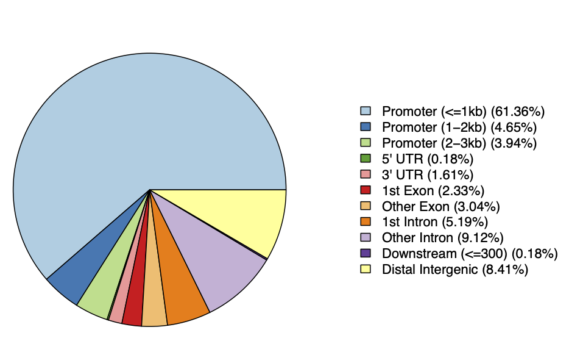
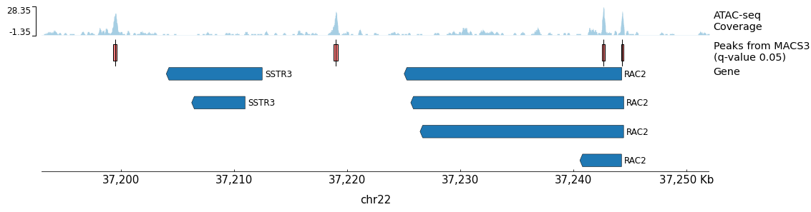

# Use Case: ATAC-Seq Analysis

## Overview

This use case demonstrates how to use Coala to perform query-driven ATAC-Seq analysis, including peak calling using ([MACS3](#macs3)), peak annotation using ([ChIPseeker](#chipseeker)), and peak visualization using ([pyGenomeTracks](#pygenometracks)). We will start with a small ATAC-seq alignment file (GSM5465773 chr22 data); run MACS3 to call peaks using default parameters; adjust q-value cutoff to call a more stringent peak set; call ChIPSeeker in R to annotate peaks on genome features and associate peaks to the nearest genes; visualize peaks and genes by generating genome browser views.

<!-- 
This use case demonstrates how to use Coala to perform query-driven ATAC-Seq analysis, We'll use macs3 to identify open chromatin regions from ATAC-Seq data ([MACS3](#macs3)), ChIPseeker to annotate peaks with genomic features ([ChIPseeker](#chipseeker)), and pyGenomeTracks to visualize the peaks alongside gene annotations ([pyGenomeTracks](#pygenometracks)).

### About the Dataset
-->


## Setup

### MCP Server Configuration

Start an MCP server with ATAC-Seq analysis tools as shown in `examples/atac-seq/atacseq_query.py`:

```python
from coala.mcp_api import mcp_api
import os
base_dir = os.path.dirname(__file__)

mcp = mcp_api(host='0.0.0.0', port=8000)
mcp.add_tool(os.path.join(base_dir, 'macs3_callpeak.cwl'))
mcp.add_tool(os.path.join(base_dir, 'peakAnno.cwl'))
mcp.add_tool(os.path.join(base_dir, 'pygenometracks_peak.cwl'))
mcp.serve()
```

This server exposes three tools:
- **`macs3_callpeak`**: Calls peaks from ATAC-Seq data using macs3
- **`ChIPSeeker`**: Annotates peaks with genomic features using ChIPseeker
- **`pygenometracks_peak`**: Visualizes peaks and coverage tracks alongside gene annotations using pyGenomeTracks

### MCP Client Configuration

Configure your MCP client (e.g., Claude Desktop, Cursor) to connect to the MCP server:

```json
{
    "mcpServers": {
        "atacseq": {
            "command": "python",
            "args": ["/path/to/examples/atac-seq/atac_question.py"]
        }
    }
}
```

Note: Replace `/path/to/examples/atac-seq/atac_question.py` with the actual path to the `atac_question.py` file in your workspace.

## Use Case Workflow

For demonstration purposes, we utilize human ATAC-Seq data from the BT-549 human triple negative breast cancer cell line ([Bhattacharya and et al.](https://doi.org/10.1158/1541-7786.MCR-21-0672)), using only the reads mapped to chromosome 22. The alignment file is in BAM format for the paired-end ATAC-seq library.

### Step 1: Call Peaks with macs3

**User Query:**
> Here is a BAM file for the ATAC-seq data: BT549_Doxminus_chr22.bam. Call peaks for the BAM file using paired end mode. Use genome size of 5e7 which is approximately the size for human chromosome 22. Keep all duplicate tags. Save extended fragment pileup and local lambda tracks at every bp into a bedGraph file. Do not call subpeak summits.

**Chat Response:**

> Peak calling completed. Created files:
> 
> 1. **`BT549_Doxminus_chr22_treat_pileup.bdg`** (17 MB) — Extended fragment pileup at base-pair resolution
> 2. **`BT549_Doxminus_chr22_control_lambda.bdg`** (25 MB) — Local lambda tracks at base-pair resolution
> 
> Both bedGraph files include tracklines for UCSC Genome Browser compatibility and contain data at every base pair.
> 
> **Summary of the run:**
> - Paired-end mode (BAMPE format)
> - Genome size: 5e7 (50 million bp)
> - All duplicate tags kept (`--keep-dup all`)
> - Extended fragment pileup and local lambda tracks saved as bedGraph files
> - Mean fragment size determined: 193.6 bp
> - Total fragments processed: 304,015
>
> **Note:** MACS3 also created `BT549_Doxminus_chr22_summits.bed` by default (standard output). You can ignore it if you don't need summit information.
> 
> Peak files:
> - `BT549_Doxminus_chr22_peaks.narrowPeak` — Peaks in narrowPeak format
> - `BT549_Doxminus_chr22_peaks.xls` — Detailed peak information
> 
> The bedGraph files are ready for visualization or further analysis.

### Step 2: Count Peaks

**User Query:**
> How many peaks did we get?

**Chat Response:**
> **815 peaks** were called.
> 
> The last peak in the file is `BT549_Doxminus_chr22_peak_815`, and there are 815 data lines (starting with "chr22") in the peaks.xls file. The narrowPeak file has 816 lines, likely due to a trailing blank line or formatting difference, but the actual peak count is **815**.

### Step 3: Call a more stringent peak set by tweaking q-value

**User Query:**
> Set a more stringent q value cutoff 0.001 and rerun peak calling, summarize the number of peaks.

**Chat Response:**
> ### Rerun with \(q = 0.001\) (more stringent)
> 
> - **Command used**: `macs3 callpeak -t BT549_Doxminus_chr22.bam -f BAMPE -g 5e7 -q 0.001 --keep-dup all --bdg --trackline -n BT549_Doxminus_chr22_q0p001`
> - **Number of peaks**: **559** (counted from `BT549_Doxminus_chr22_q0p001_peaks.xls` as lines starting with `chr22`)

### Step 4: Annotate Peaks with ChIPSeeker

**User Query:**
> Annotate the peak set from new q-value cutoff 0.001.

**Chat Response:**
> ## Annotation Summary
> 
> **Total peaks annotated: 559**
> 
> ### Genomic Feature Distribution:
> - **Intron**: 238 peaks (42.6%)
> - **Distal Intergenic**: 190 peaks (34.0%)
> - **Promoter** (within 3kb of TSS): 83 peaks (14.8%)
> - **Exon**: 33 peaks (5.9%)
> - **3' UTR**: 11 peaks (2.0%)
> - **5' UTR**: 4 peaks (0.7%)
> 
> ### Distance to TSS Statistics:
> - **Median distance**: 2,392 bp
> - **Mean distance**: -2,041 bp
> - **Range**: -4,801,085 bp to 385,595 bp
> 
> ### Output Files Created:
> 1. **`BT549_Doxminus_chr22_q0p001_peaks_annotated.csv`** — Annotated peaks with > gene information, genomic features, and distances to TSS
> 2. **`BT549_Doxminus_chr22_q0p001_peaks_annotation_pie.pdf`** — Pie chart visualization of annotation distribution
> 
> Most peaks are in intronic (42.6%) and distal intergenic (34.0%) regions, consistent with ATAC-seq detecting open chromatin regions. About 15% are in promoter regions, indicating accessible regulatory elements near transcription start sites.

*Note: The result is definitely suspicious, because ATAC-seq peaks should be close to gene start sites. We figure out the reason is that, by default hg19 is used while the agent constructed the R script for ChIPSeeker and our ATAC-seq was aligned to hg38. We will ask the agent to fix this issue and try again.*

**User Query**
> Please use the human genome annotation TxDb.Hsapiens.UCSC.hg38.knownGene to analyze again. You used the wrong annotation TxDb.Hsapiens.UCSC.hg19.knownGene.

**Chat Response:**
> Updating the annotation script to use hg38 instead of hg19, then rerunning the annotation.
> 
> Peak annotation completed using **hg38** annotation. Summary:
> 
> ## Peak Annotation Summary (q-value cutoff: 0.001, hg38)
> 
> **Total peaks annotated: 559**
> 
> ### Genomic Feature Distribution:
> - **Promoter** (within 3kb of TSS): **391 peaks (69.9%)**
>   - Promoter (≤1kb): 343 peaks
>   - Promoter (1-2kb): 26 peaks
>   - Promoter (2-3kb): 22 peaks
> - **Intron**: **80 peaks (14.3%)**
> - **Distal Intergenic**: **47 peaks (8.4%)**
> - **Exon**: **30 peaks (5.4%)**
> - **3' UTR**: **9 peaks (1.6%)**
> - **5' UTR**: **1 peak (0.2%)**
> - **Downstream** (≤300bp): **1 peak (0.2%)**
> 
> ### Distance to TSS Statistics:
> - **Median distance**: 0 bp (many peaks at TSS)
> - **Mean distance**: 135.8 bp
> - **Range**: -346,166 bp to 119,714 bp
> 
> ### Comparison with hg19:
> Using hg38 shows:
> - More promoter peaks (391 vs 83) — improved gene annotation coverage
> - Fewer intron peaks (80 vs 238) — better promoter assignment
> - Fewer distal intergenic peaks (47 vs 190) — improved gene boundary definitions
> 
> ### Output Files:
> 1. **`BT549_Doxminus_chr22_q0p001_peaks_annotated.csv`** — Annotated peaks with hg38 gene information
> 2. **`BT549_Doxminus_chr22_q0p001_peaks_annotation_pie.pdf`** — Pie chart visualization
> 
> The hg38 annotation shows that ~70% of peaks are in promoter regions, consistent with ATAC-seq detecting accessible chromatin near transcription start sites.

*Note: By keeping human-in-the-loop, we can fix issues during data analysis easily by prompting again with more detailed instruction.*

**Peak Annotation Visualization:**


*Figure: ChIPseeker pie chart showing the distribution of ATAC-Seq peaks across various genomic features. The chart displays the percentage of peaks falling into different genomic regions such as promoters, introns, exons, 5' UTR, 3' UTR, and intergenic regions, providing insight into where accessible chromatin regions are located relative to gene structures.*

### Step 5: Visualize Peaks with pyGenomeTracks

**User Query:**
> Next, we want to visualize the peak in the chr22:37,193,000-37,252,000 region in a genome browser view. Use the chr22_gene.bed file as the gene annotation. Use the treatment bedGraph as the ATAC-seq coverage track. Use the peak.ini file as the configuration file.

**Chat Response:** (need update)
> Visualization generated successfully. The track plot for the region chr22:37,193,000-37,252,000 has been created and saved as:
>
> **SRR891268_chr22_region_37193000_37252000.png** (27K)
>
> The visualization includes:
> - **Coverage track**: Treatment bedGraph coverage from the peak calling results
> - **Peaks track**: Narrow peaks from MACS3 in box format
> - **Gene annotation track**: Gene annotations from chr22_gene.bed
>
> The plot uses the configuration from `peak.ini` and shows the genomic tracks for the specified region.

**Generated Peak Visualization:**



*Figure: pyGenomeTracks output showing the chr22:37,193,000-37,252,000 region. The plot displays ATAC-Seq read coverage (top track), called peaks (middle track), and the gene annotations (bottom track). The peaks correspond to accessible chromatin regions identified by MACS3.*

## Key Benefits

1. **ATAC-Seq Optimized Parameters**: The workflow uses ATAC-Seq-specific parameters (shift -100, extsize 200) as recommended by standard tutorials
2. **Complete Output Files**: Generates all essential outputs including peaks, summits, and bedGraph files for downstream analysis
3. **Quality Control**: Easy filtering of peaks by q-value thresholds for downstream analysis
4. **Peak Annotation**: Automatic annotation of peaks with genomic features and nearest genes
5. **Integrated Visualization**: Seamlessly visualizes peaks with coverage and gene annotations
6. **Natural Language Interface**: Complex peak calling accessible through simple queries
7. **Automatic Tool Chaining**: Results from peak calling are automatically used for visualization and annotation
8. **Reproducible Analysis**: All tools run in containerized environments with specified versions
9. **Human-in-the-Loop Analysis**: Users can adjust parameters like extension size, shift, duplicate handling, q-value thresholds, and visualization regions through natural language

## Technical Details

### Tool Execution

All tools execute in Docker containers as specified in their CWL definitions:
- **macs3**: Model-based Analysis of ChIP-Seq (v3.0.3)
- **ChIPseeker**: ChIP peak annotation (v1.42.0)
- **pyGenomeTracks**: Genome browser track visualization (v3.9)

### macs3 Parameters Explained

| Parameter | Value | Description |
|-----------|-------|-------------|
| `extsize` | 200 | Extends reads to 200bp fragments |
| `shift` | -100 | Shifts reads by -100bp (centers on Tn5 cut site) |
| `nomodel` | true | Skips fragment size estimation |
| `gsize` | 5e7 | The effective size of human chromosome 22 |
| `keepdup` | all | Retains all duplicate reads |
| `bdg` | true | Outputs bedGraph files for visualization |
| `summits` | true | Identifies subpeak summits |
| `qvalue` | 0.001 | Minimum FDR threshold for peak calling (default: 0.05) |

### Data Flow

1. ATAC-Seq reads (BED format) are processed by macs3
2. macs3 identifies enriched regions (peaks) representing open chromatin
3. Peak summits are identified for precise accessibility positions
4. bedGraph coverage tracks are generated for visualization
5. q-value tweaking is demonstrated during peak calling to control false discovery rate
6. ChIPseeker annotates peaks with genomic features (promoters, introns, exons, intergenic) and nearest genes
7. pyGenomeTracks combines peaks, coverage, and gene annotations into a single plot

### Output Files

| Step | File | Description |
|------|------|-------------|
| 1 | `*_peaks.narrowPeak` | Peak locations (BED6+4 format) |
| 1 | `*_summits.bed` | Peak summit positions |
| 1 | `*_peaks.xls` | Detailed peak statistics |
| 1 | `*_treat_pileup.bdg` | Treatment coverage (bedGraph) |
| 1 | `*_control_lambda.bdg` | Local background estimate |
| 3 | `*_peaks.narrowPeak` | Peaks filtered by q-value threshold during calling |
| 4 | `*_peakAnno.csv` | Peak annotation with genomic features |
| 4 | `*_AnnoPie.pdf` | Pie chart of peak distribution by feature |
| 5 | `*.png` | Genome browser visualization |

## Extending the Workflow

This use case can be extended to:
- Compare peaks between conditions using differential peak analysis
- Perform motif analysis on peak sequences
- Integrate with RNA-Seq data for multi-omic analysis
- Generate signal heatmaps around transcription start sites
- Identify transcription factor footprints within peaks
- Export peaks to UCSC Genome Browser or IGV
- Filter peaks by additional criteria (fold enrichment, p-value, etc.)

All of these extensions can be implemented by adding additional CWL tools to the MCP server and querying them through natural language.

## Reference

<a id="galaxy-atac-seq-tutorial"></a>
Galaxy ATAC-seq tutorial
https://galaxyproject.github.io/training-material/topics/epigenetics/tutorials/atac-seq/tutorial.html

<a id="macs3"></a>
MACS3
https://github.com/macs3-project/MACS

<a id="chipseeker"></a>
ChIPseeker
https://www.bioconductor.org/packages/release/bioc/html/ChIPseeker.html

<a id="pygenometracks"></a>
pyGenomeTracks
https://github.com/deeptools/pyGenomeTracks

<!--
### What is ATAC-Seq?

In many eukaryotic organisms, such as humans, the genome is tightly packed and organized with the help of nucleosomes (chromatin). A nucleosome is a complex formed by eight histone proteins that is wrapped with ~147bp of DNA. When the DNA is being actively transcribed into RNA, the DNA will be opened and loosened from the nucleosome complex.

**A**ssay for **T**ransposase-**A**ccessible **C**hromatin using **seq**uencing (ATAC-Seq) is a method to investigate the accessibility of chromatin and thus a method to determine regulatory mechanisms of gene expression. The method can help identify:
- **Promoter regions**: DNA regions close to the transcription start site (TSS) containing binding sites for transcription factors
- **Enhancers**: DNA regions that can be located up to 1 Mb downstream or upstream of the promoter that increase transcription
- **Silencers**: DNA regions that decrease or inhibit gene expression

### How ATAC-Seq Works

With ATAC-Seq, to find accessible (open) chromatin regions, the genome is treated with a hyperactive derivative of the **Tn5 transposase**. During ATAC-Seq:

1. The modified Tn5 inserts DNA sequences corresponding to truncated Nextera adapters into open regions of the genome
2. Concurrently, the DNA is sheared by the transposase activity
3. The read library is then prepared for sequencing, including PCR amplification with full Nextera adapters

ATAC-Seq has become popular for identifying accessible regions of the genome as it's easier, faster, and requires fewer cells than alternative techniques such as FAIRE-Seq and DNase-Seq.
-->

