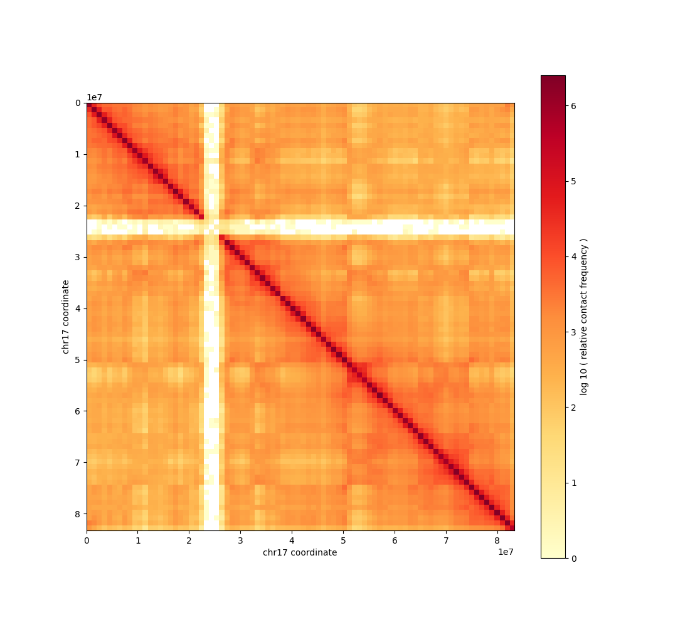
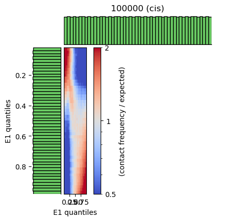

# Use Case: Hi-C Analysis

## Overview

This use case demonstrates how to use Coala to perform query-driven Hi-C analysis, including ...

## Setup

### MCP Server Configuration

Start an MCP server with Hi-C analysis tools as shown in `examples/hi-c/hi-c.py`:

```python
from coala.mcp_api import mcp_api
import os
base_dir = os.path.dirname(__file__)

mcp = mcp_api(host='0.0.0.0', port=8000)
mcp.add_tool(os.path.join(base_dir, 'cooler_dump.cwl'))
mcp.add_tool(os.path.join(base_dir, 'cooler_show.cwl'))
mcp.add_tool(os.path.join(base_dir, 'cooltools_eigs_cis.cwl'))
mcp.add_tool(os.path.join(base_dir, 'cooltools_expected_cis.cwl'))
mcp.add_tool(os.path.join(base_dir, 'cooltools_genome_gc.cwl'))
mcp.add_tool(os.path.join(base_dir, 'cooltools_insulation.cwl'))
mcp.add_tool(os.path.join(base_dir, 'cooltools_saddle.cwl'))
mcp.serve()
```

This server exposes the common functionalities from two tools -- `cooler` and `cooltools`.

### MCP Client Configuration

Configure your MCP client (e.g., Claude Desktop, Cursor) to connect to the MCP server:

```json
{
    "mcpServers": {
        "atacseq": {
            "command": "python",
            "args": ["/path/to/examples/hi-c/hi-c.py"]
        }
    }
}
```

Note: Replace `/path/to/examples/hi-c/hi-c.py` with the actual path to the `i-c.py` file in your workspace.

## Use Case Workflow

For demonstration purposes, we follow the same workflow in `cooltools` command line tutorial, using the `test.mcool` file whch contains Micro-C data from HFF cells for two chromosomes in a multi-resolution `mcool` format.

### Step 1: Show contact map of chromosome 2

**User Query:**
> Here is a mcool file for the Hi-C data: `test.mcool`. Show the contact map on chromosome 2 with 1000000 bps resolution.

**Chat Response:**
> Generated the chr2 contact map at 1 Mb resolution and saved it as `chr2_1Mb_contact_map.png` in the project directory.
> 
> Tool Invocation Summary:
>  * tool_name: `cooler_show`
>  * tool_version: `quay.io/biocontainers/cooltools:0.7.1--py311h93dcfea_3`


**User Query:**
> How about chr17?

**Chat Response:**
> Generated the chr17 contact map at 1 Mb resolution and saved it as `chr17_1Mb_contact_map.png` in the project directory.
> 
> Tool Invocation Summary:
>  * tool_name: `cooler_show`
>  * tool_version: `quay.io/biocontainers/cooltools:0.7.1--py311h93dcfea_3`




### Step 2: Calculate expected cis-contacts 

**User Query:**
> Now, let's calculate the expected contacts in the regions defined in 'view_hg38.tsv' file.

**Chat Response:**
> Calculated expected contacts for the regions in `view_hg38.tsv` and saved the result to `expected_view_hg38_1Mb.tsv` in the project directory.
> 
> Tool Invocation Summary:
>  * tool_name: `cooltools_expected_cis`
>  * tool_version: `quay.io/biocontainers/cooltools:0.7.1--py311h93dcfea_3`

**User Query**
> Please show me the first 10 rows of the calculated expected contacts result.

**Chat Response:**
> Here are the first 10 rows from `expected_view_hg38_1Mb.tsv`:
> 
> ```
> region1	region2	dist	dist_bp	contact_frequency	n_total	n_valid	count.sum	balanced.sum	count.avg	balanced.avg
> chr2_p	chr2_p	0	0	nan	94	88	nan	nan	nan	nan
> chr2_p	chr2_p	1	1000000	nan	93	86	nan	nan	nan	nan
> chr2_p	chr2_p	2	2000000	0.07736550497047255	92	86	1141747.0	6.65343342746064	12410.29347826087	0.07736550497047255
> chr2_p	chr2_p	3	3000000	0.040104649890807864	91	85	615920.0	3.4088952407186683	6768.351648351649	0.040104649890807864
> chr2_p	chr2_p	4	4000000	0.02776806252695501	90	84	422238.0	2.332517252264221	4691.533333333334	0.02776806252695501
> chr2_p	chr2_p	5	5000000	0.021942962487346826	89	83	324539.0	1.8212658864497866	3646.505617977528	0.021942962487346826
> chr2_p	chr2_p	6	6000000	0.019103988065201645	88	82	275690.0	1.5665270213465348	3132.840909090909	0.019103988065201645
> chr2_p	chr2_p	7	7000000	0.017505098733041995	87	81	248706.0	1.4179129973764018	2858.689655172414	0.017505098733041995
> chr2_p	chr2_p	8	8000000	0.016540938934592762	86	80	235603.0	1.323275114767421	2739.5697674418607	0.016540938934592762
> ```


### Step 3: Generate compartment profiles

**User Query:**
> Next, we want to obtain the compartment profiles using eigendecomposation. We will use GC profile for phasing the eigenvectors. Let's use the GC content in gc.100000.tsv.

**Chat Response:**
> Computed cis eigenvectors at 100 kb with GC-based phasing and wrote the outputs to `compartments_100kb.cis.vecs.tsv` and `compartments_100kb.cis.lam.txt` in the project directory.
> 
> Tool Invocation Summary:
>  * tool_name: `cooltools_eigs_cis`
>  * tool_version: `hubentu/cooltools_bedwig:0.7.1_2.10`

**User Query**
> Please show me the first 10 rows of the output file containing eigenvectors.

**Chat Response:**
> Here are the first 10 rows from compartments_100kb.cis.vecs.tsv:
> 
> ```
> chrom	start	end	weight	E1
> chr2	0	100000	0.006753896776031722	-0.7208763866619383
> chr2	100000	200000	0.006767247672675303	-0.7509687852724986
> chr2	200000	300000	0.004637635342840809	0.29459214704882253
> chr2	300000	400000	0.006033848904868106	-0.6756503683058006
> chr2	400000	500000	0.006152651351662496	-0.8203464505092607
> chr2	500000	600000	0.005040530071650813	-0.42987920022604925
> chr2	600000	700000	0.0037670242720060556	0.1713526511056065
> chr2	700000	800000	0.0048030720191339854	-0.1530690703056947
> chr2	800000	900000	0.0058058067994520655	-0.46568371473713405
> ```

### Step 4: Make saddleplot for visualizing compartmentalization result

**User Query:**
> Next, we want to visualize the effect of compartmentalization using saddleplot, using our previously computed eigenvectors and expected cis-contacts.

**Chat Response:**
> Generated the saddle plot and outputs using the existing eigenvectors and expected cis-contacts (with the view file to match regions). Files saved to:
>  * `saddle_100kb.png`
>  * `saddle_100kb.saddledump.npz`
>  * `saddle_100kb.digitized.tsv`
> 
> Tool Invocation Summary:
>  * tool_name: `cooltools_saddle`
>  * tool_version: `quay.io/biocontainers/cooltools:0.7.1--py311h93dcfea_3`



*Note: the figure looks squeezed due to issue between `matplotlib` and `cooltools`.*

### Step 5: Call boundaries between TADs.

**User Query:**
> Lastly, let's find the boundaries between TADs. Let's use higher resolution data in 10000bps, to define boundaries in window size 100000bps and 200000bps, using Li method for insulation scores.

**Chat Response:**
> Generated TAD boundary insulation scores at 10kb with 100kb/200kb windows (Li method), and saved the result to `insulation_10kb.tsv`.
> 
> Tool Invocation Summary:
>  * tool_name: `cooltools_insulation`
>  * tool_version: `hubentu/cooltools_bedwig:0.7.1_2.10`

**User Query**
> Please show me the first 10 rows of the output file of insulation site analysis.

**Chat Response:**
> Here are the first 10 rows of the insulation output (insulation_10kb):
> ```
> chrom	start	end	region	is_bad_bin	log2_insulation_score_100000	n_valid_pixels_100000	log2_insulation_score_200000	n_valid_pixels_200000	boundary_strength_100000	boundary_strength_200000	is_boundary_100000	is_boundary_200000
> chr2	0	10000	chr2_p	True	nan	0.0	nan	0.0	nan	nan	False	False
> chr2	10000	20000	chr2_p	False	0.6920511045925822	8.0	1.123244773139978	18.0	nan	nan	False	False
> chr2	20000	30000	chr2_p	False	0.7605614976174994	17.0	1.1966433846772861	37.0	nan	nan	False	False
> chr2	30000	40000	chr2_p	False	0.766697670784129	27.0	1.2117481215333632	57.0	nan	nan	False	False
> chr2	40000	50000	chr2_p	False	0.6749057177273853	37.0	1.135036666242489	77.0	nan	nan	False	False
> chr2	50000	60000	chr2_p	False	0.5959103148287388	47.0	1.0617552436740376	97.0	nan	nan	False	False
> chr2	60000	70000	chr2_p	False	0.5575385844294153	57.0	1.0061780459304999	117.0	nan	nan	False	False
> chr2	70000	80000	chr2_p	False	0.4888584164949332	67.0	0.9194922005805989	137.0	nan	nan	False	False
> chr2	80000	90000	chr2_p	False	0.4373482061511735	77.0	0.8509420575105128	157.0	nan	nan	False	False
> ```


