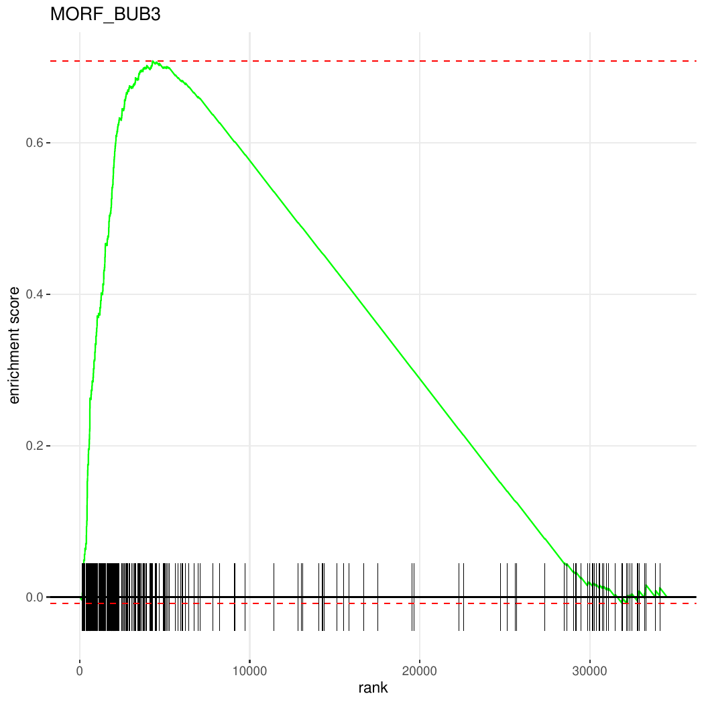

# Use Case: RNA-Seq Differential Expression and Pathway Analysis

## Overview

This use case demonstrates how to use Coala to perform a complete RNA-Seq analysis workflow: downloading data from GEO, performing differential gene expression (DEG) analysis, running Gene Set Enrichment Analysis (GSEA), and generating enrichment plots. We'll use the GSE164141 dataset as an example, which contains RNA-Seq data from BT549 breast cancer cells.

## Setup

### MCP Server Configuration

Create an MCP server with RNA-Seq analysis tools as shown in `examples/RNASeq/rnaseq_question.py`:

```python
from coala.mcp_api import mcp_api
import os
base_dir = os.path.dirname(__file__)

mcp = mcp_api(host='0.0.0.0', port=8000)
mcp.add_tool(os.path.join(base_dir, 'getGEOs.cwl'), 'getGEOs', read_outs=False)
mcp.add_tool(os.path.join(base_dir, 'DEG.cwl'), 'DEG', read_outs=False)
mcp.add_tool(os.path.join(base_dir, 'pathdb.cwl'), 'pathdb', read_outs=False)
mcp.add_tool(os.path.join(base_dir, 'gsea.cwl'), 'gsea', read_outs=False)
mcp.add_tool(os.path.join(base_dir, 'plotGSEA.cwl'), 'plotGSEA', read_outs=False)
mcp.serve()
```

This server exposes five tools:
- **`getGEOs`**: Downloads sample metadata and expression matrices from GEO database
- **`DEG`**: Performs differential expression analysis using [DESeq2](#deseq2)
- **`pathdb`**: Downloads pathway gene sets from MSigDB
- **`gsea`**: Runs Gene Set Enrichment Analysis
- **`plotGSEA`**: Creates enrichment plots for specific pathways

### MCP Client Configuration

Configure your MCP client (e.g., in Cursor) to connect to the server:

```json
{
    "mcpServers": {
        "coala": {
            "url": "http://localhost:8000/mcp",
            "transport": "streamable-http"
        }
    }
}
```

## Use Case Workflow

### Step 1: Download GEO Dataset

**User Query:**
```
download sample information and count matrix for GSE164141
```

**Tool Invocation:**
```json
{
  "tool": "getGEOs",
  "parameters": {
    "geo": "GSE164141"
  }
}
```

**Tool Response:**
```json
{
  "mfile": {
    "basename": "GSE164141_series_matrix.txt.gz",
    "size": 2466
  },
  "sfile": {
    "basename": "GSE164141_BT549_RawCounts_Matrix.csv.gz",
    "size": 443412
  },
  "tool_name": "getGEOs",
  "tool_version": "quay.io/biocontainers/bioconductor-geoquery:2.74.0--r44hdfd78af_0"
}
```

**Chat Response:**
> Successfully downloaded the data for **GSE164141**. Here are the files retrieved:
>
> **1. Series Matrix File (Sample Information):**
> - File: `GSE164141_series_matrix.txt.gz`
> - Size: 2,466 bytes
> - Contains: Sample metadata, platform information, and experimental design details
>
> **2. Count Matrix File (Supplementary Data):**
> - File: `GSE164141_BT549_RawCounts_Matrix.csv.gz`
> - Size: 443,412 bytes
> - Contains: Raw counts matrix for BT549 cell line RNA-seq data
>
> These files can now be used for downstream analysis such as differential gene expression (DEG) analysis.

### Step 2: Differential Expression Analysis

**User Query:**
```
For the Count Matrix of GSE164141, sample can be labelled to 2 groups: minus,minus,minus,plus,plus,plus. Do a DEG for the samples between the two groups.
```

**Tool Invocation:**
```json
{
  "tool": "DEG",
  "parameters": {
    "counts": "/tmp/tmpzf9hfd0n/GSE164141_BT549_RawCounts_Matrix.csv.gz",
    "group": "minus,minus,minus,plus,plus,plus"
  }
}
```

**Tool Response:**
```json
{
  "deg": {
    "basename": "DEG_plus_minus.csv",
    "size": 4570052
  },
  "tool_name": "DEG",
  "tool_version": "quay.io/biocontainers/bioconductor-deseq2:1.46.0--r44he5774e6_1"
}
```

**Chat Response:**
> The differential gene expression analysis completed successfully.
>
> **DEG Analysis Output:**
> - File: `DEG_plus_minus.csv`
> - Size: 4,570,052 bytes (~4.5 MB)
>
> **Analysis Details:**
> - **Comparison**: plus vs minus groups
> - **Method**: DESeq2
> - **Samples**: 6 total (3 minus, 3 plus)
>
> **Output Columns:**
> - `baseMean`: Average normalized count across all samples
> - `log2FoldChange`: Log2 fold change (plus/minus)
> - `lfcSE`: Standard error of the log2 fold change
> - `stat`: Wald test statistic
> - `pvalue`: Raw p-value
> - `padj`: Adjusted p-value (Benjamini-Hochberg correction)
>
> The DEG results can be used for downstream analyses such as Gene Set Enrichment Analysis (GSEA) or pathway analysis.

### Step 3: Download Pathway Database

**User Query:**
```
Download C4 pathways from msigdb.
```

**Tool Invocation:**
```json
{
  "tool": "pathdb",
  "parameters": {
    "collection": "C4",
    "species": "human"
  }
}
```

**Tool Response:**
```json
{
  "pathway": {
    "basename": "human_C4_pathway.txt",
    "size": 615405
  },
  "tool_name": "pathdb",
  "tool_version": "hubentu/gsea"
}
```

**Chat Response:**
> Successfully downloaded the C4 pathway collection from MSigDB.
>
> **Pathway Database Output:**
> - File: `human_C4_pathway.txt`
> - Size: 615,405 bytes (~615 KB)
> - Species: Homo sapiens
>
> **About C4 Collection:**
> The C4 collection contains **computational gene sets** from MSigDB, which includes:
> - Cancer modules derived from large-scale cancer expression data
> - Cancer gene neighborhoods
> - Computationally derived gene sets
>
> Each row in the file contains a pathway ID followed by the associated gene symbols, ready for use in Gene Set Enrichment Analysis (GSEA).

### Step 4: Gene Set Enrichment Analysis

**User Query:**
```
Do a GSEA analysis using the previous DEG results and downloaded C4 pathways.
```

**Tool Invocation:**
```json
{
  "tool": "gsea",
  "parameters": {
    "deg_res": "/tmp/tmp5v7ucdhf/DEG_plus_minus.csv",
    "pathways": "/tmp/tmpp8044iss/human_C4_pathway.txt"
  }
}
```

**Tool Response:**
```json
{
  "gsea": {
    "basename": "gsea_ranked.csv",
    "size": 260077
  },
  "tool_name": "gsea",
  "tool_version": "hubentu/gsea"
}
```

**Chat Response:**
> The GSEA analysis completed successfully.
>
> **GSEA Analysis Output:**
> - File: `gsea_ranked.csv`
> - Size: 260,077 bytes (~260 KB)
>
> **Analysis Details:**
> - **DEG Input**: DEG results from plus vs minus comparison
> - **Pathway Database**: MSigDB C4 collection (computational gene sets)
> - **Method**: Gene Set Enrichment Analysis using ranked gene list
>
> **Output Contains:**
> - Pathway names
> - Enrichment scores
> - Normalized enrichment scores (NES)
> - P-values and adjusted p-values
> - Leading edge genes
>
> The results identify which computational gene sets (cancer modules, gene neighborhoods) are significantly enriched in genes that are differentially expressed between the plus and minus groups.

### Step 5: Generate Enrichment Plot

**User Query:**
```
create enrichment plot for "MORF_BUB3" pathway
```

**Tool Invocation:**
```json
{
  "tool": "plotGSEA",
  "parameters": {
    "deg_res": "/tmp/tmp5v7ucdhf/DEG_plus_minus.csv",
    "pathways": "/tmp/tmpp8044iss/human_C4_pathway.txt",
    "pathway_plot": "MORF_BUB3"
  }
}
```

**Tool Response:**
```json
{
  "gsea_plot": {
    "basename": "MORF_BUB3.pdf",
    "size": 9271
  },
  "tool_name": "plotGSEA",
  "tool_version": "hubentu/gsea"
}
```

**Chat Response:**
> Successfully created the enrichment plot for the MORF_BUB3 pathway.
>
> **GSEA Enrichment Plot Output:**
> - File: `MORF_BUB3.pdf`
> - Size: 9,271 bytes (~9 KB)
>
> **Plot Contents:**
> The enrichment plot shows:
> - **Enrichment Score (ES) curve**: Running enrichment score across the ranked gene list
> - **Gene hits**: Vertical bars indicating where genes in the MORF_BUB3 pathway appear in the ranked list
> - **Ranking metric**: The distribution of gene ranking values (based on log2 fold change or test statistic)
>
> This visualization helps assess whether genes in the MORF_BUB3 pathway are concentrated at the top (upregulated) or bottom (downregulated) of the ranked gene list.

**Generated Enrichment Plot:**



*Figure: GSEA enrichment plot for the MORF_BUB3 pathway showing the running enrichment score, gene hits, and ranking metric distribution.*

## Key Benefits

1. **Complete Workflow**: End-to-end RNA-Seq analysis from data download to visualization
2. **Natural Language Interface**: Complex bioinformatics analysis accessible through simple queries
3. **Automatic Tool Chaining**: Results from one step are automatically used in subsequent steps
4. **Reproducible Analysis**: All tools run in containerized environments with specified versions
5. **Flexible Grouping**: Sample groups can be specified dynamically for any experimental design
6. **Multiple Pathway Collections**: Access to all MSigDB collections (H, C1-C8) for comprehensive analysis
7. **Human-in-the-Loop Analysis**: Users maintain full control throughout the analysis process. You can adjust p-value cutoffs for significance thresholds, specify pathways of interest for focused analysis, modify sample groupings, select different pathway collections based on biological context, and generate custom visualizations for specific pathways—all through natural language interaction without modifying code

## Technical Details

### Tool Execution

All tools execute in Docker containers as specified in their CWL definitions:
- **[GEOquery](#geoquery)**: Bioconductor package for GEO data retrieval (v2.74.0)
- **[DESeq2](#deseq2)**: Bioconductor package for differential expression (v1.46.0)
- **[fgsea](#fgsea)**: Fast GSEA implementation for pathway analysis

### Data Flow

1. GEO dataset is downloaded with metadata and count matrix
2. Count matrix is normalized and analyzed by [DESeq2](#deseq2)
3. Genes are ranked by test statistic for GSEA
4. Pathway enrichment is computed and visualized

### Output Files

| Step | File | Description |
|------|------|-------------|
| 1 | `*_series_matrix.txt.gz` | Sample metadata |
| 1 | `*_RawCounts_Matrix.csv.gz` | Raw count matrix |
| 2 | `DEG_*.csv` | Differential expression results |
| 3 | `*_pathway.txt` | Pathway gene sets |
| 4 | `gsea_ranked.csv` | GSEA enrichment results |
| 5 | `*.pdf` | Enrichment plot |

## Extending the Workflow

This use case can be extended to:
- Analyze multiple GEO datasets for meta-analysis
- Use different pathway collections (Hallmark, KEGG, Reactome, GO)
- Apply different DEG methods (edgeR, limma-voom)
- Generate heatmaps of top differentially expressed genes
- Perform over-representation analysis (ORA) in addition to GSEA
- Export results in formats compatible with other visualization tools

All of these extensions can be implemented by adding additional CWL tools to the MCP server and querying them through natural language.

## Reference

<a id="geoquery"></a>
GEOquery
https://github.com/seandavi/GEOquery

<a id="deseq2"></a>
DESeq2
https://github.com/thelovelab/DESeq2

<a id="fgsea"></a>
fgsea
https://github.com/alserglab/fgsea
